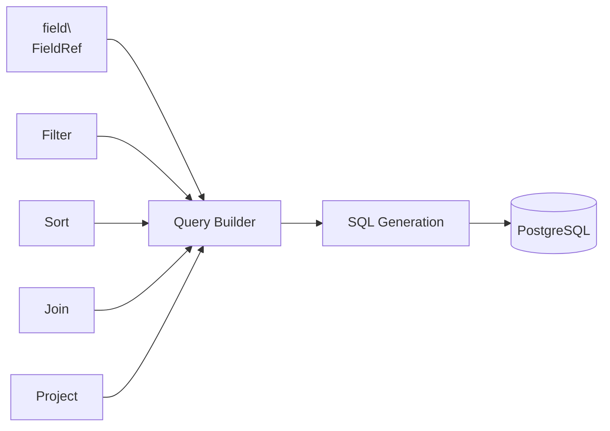
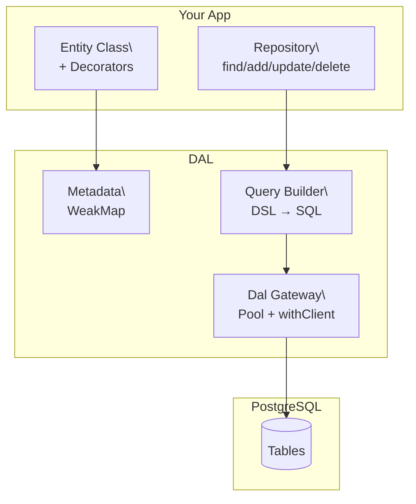
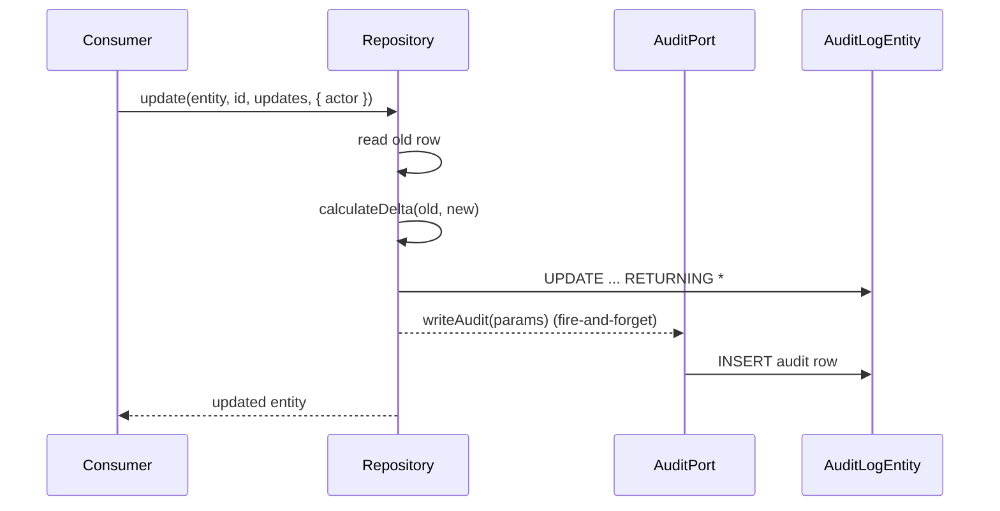
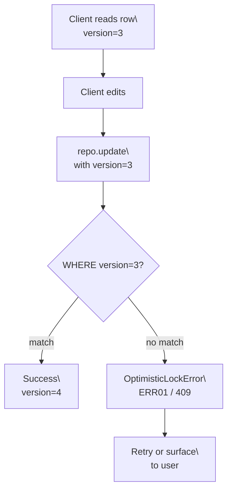

# DAL User-Guide Documentation Plan

> **Status:** Draft for user approval
> **Scope:** `D:\git\primebrick\primebrick-dal` — `docs/user-guide/` only
> **Execution:** This plan will be executed by the parent agent after user approval. No doc files are created in this step.

---

## Overview

The DAL repo (`primebrick-dal-v3`) ships a powerful, type-driven, metadata-based PostgreSQL data access layer, but its `docs/user-guide/` currently contains only advanced-feature pages (audit-trail, optimistic-lock, clone) plus a changelog-as-landing-page (`index.mdx`). There is **no getting-started content**, **no architecture explanation**, **no entity-definition guide**, **no query DSL guide**, **no repository API guide**, and **no connection/gateway guide**.

This plan transforms the DAL user-guide into a complete, professional developer guide with:
- Complete, runnable TypeScript examples (with imports) on every page
- Mermaid diagrams via `<Mermaid chart={...} />` (never fenced code blocks)
- "Next steps" navigation links at the bottom of every page
- A proper landing page instead of a changelog
- A dedicated changelog page

The plan touches **12 files** (7 new, 4 updated, 1 config) and introduces **no source-code changes**.

---

## Objectives

1. **Transform DAL docs from "advanced-features-only" into a complete developer guide.** A new developer should be able to read the guide end-to-end and learn: how to install/configure the Dal gateway, how to define an entity, how to perform CRUD, how to use the query DSL (Filter/Sort/Join/Project), how to handle connections and transactions, and how the framework is architected.
2. **Every page has complete, runnable TypeScript examples with imports.** No partial snippets. Show the `import` statements and enough context that a developer can copy-paste and adapt.
3. **Every page has "Next steps" links at the bottom** pointing to the logically adjacent pages.
4. **Mermaid diagrams use the `<Mermaid chart={...} />` component.** Never ` ```Code ` blocks, never ` ```mermaid ` fenced blocks.
5. **MDX escaping is applied in prose and table cells:**
   - Escape `<` as `&lt;` in TS generics (e.g. `Repository&lt;TEntity&gt;`)
   - Escape `{` as `&lbrace;` and `}` as `&rbrace;` in TS object types in prose/tables
   - Use `[text](url)` for links — never `<url>` angle-bracket autolinks
6. **No invented APIs.** All examples use the exact signatures listed in the "Authoritative API surface" section below.
7. **Minimal edits to existing pages.** Preserve existing prose structure; only add the required sections (diagrams, setup, examples, Next steps).

---

## Impacted Files

### NEW pages to create (7)

| # | File | Purpose |
|---|------|---------|
| 1 | `docs/user-guide/getting-started.mdx` | Install, setup, first entity, basic CRUD, running |
| 2 | `docs/user-guide/entities.mdx` | All decorators, type inference, entity interfaces, complete entity example |
| 3 | `docs/user-guide/query-dsl.mdx` | `field()`, `Filter`, `Sort`, `Join`, `Project` with complete examples |
| 4 | `docs/user-guide/repository.mdx` | Finders, writes, bulk, clone, options, `deletedRecords` modes, streaming, error handling |
| 5 | `docs/user-guide/connections.mdx` | Dal gateway, `getDal()`, `DalConfig`, pool management, `withClient`, per-call timeout, graceful shutdown, type parsers |
| 6 | `docs/user-guide/architecture.mdx` | High-level architecture diagram, module structure, entity metadata system, query builder pipeline, type coercion, bulk strategies, audit integration, error philosophy |
| 7 | `docs/user-guide/changelog.mdx` | Moved "What's new" and "Breaking changes in 0.1.9" sections from `index.mdx` |

### EXISTING pages to update (4)

| # | File | Change |
|---|------|--------|
| 8 | `docs/user-guide/index.mdx` | **Rewrite** as a proper landing page: overview, key features, Hello World example, architecture diagram, links to conceptual pages. Move changelog content to `changelog.mdx`. |
| 9 | `docs/user-guide/audit-trail.mdx` | Add Mermaid sequence diagram, "Setup" section with SQL schema, end-to-end example, `@AuditTrail` vs `@AuditTrailEntity` comparison table, ensure "Next steps" |
| 10 | `docs/user-guide/clone.mdx` | Add Mermaid flow diagram of the 7-step clone process, "Use cases" section, try/catch error handling example, ensure "Next steps" |
| 11 | `docs/user-guide/optimistic-lock.mdx` | Add Mermaid flow diagram of the guard flow, "Retry pattern" section, "Bulk operations" section, consumer-side Express error handling example, ensure "Next steps" |

### CONFIG to update (1)

| # | File | Change |
|---|------|--------|
| 12 | `docs/user-guide/_order.json` | New page order (see below) |

**New `_order.json`:**

```json
{
  "pages": ["index", "getting-started", "architecture", "entities", "query-dsl", "repository", "connections", "audit-trail", "optimistic-lock", "clone", "changelog", "api-reference"]
}
```

---

## Per-File Plan

### 1. `docs/user-guide/getting-started.mdx` (NEW)

**Goal:** Get a developer from zero to a working CRUD app in one page.

**Sections:**
- **Prerequisites** — Node 18+, PostgreSQL 14+, `@primebrick/dal-pg` installed
- **Installation** — `pnpm add @primebrick/dal-pg` and peer dep `pg`
- **Database setup** — minimal SQL: create schema, create a `users` table with `id bigserial`, `uuid uuid default gen_random_uuid()`, `display_name text`, `version int default 0`, audit columns
- **Configure the Dal gateway** — `getDal({ connectionString, schema, max })` with env var example
- **Define your first entity** — `User` class with `@Entity`, `@Key`, `@Column`, `@AuditableField`, implementing `IAuditableEntity`
- **Perform CRUD** — `dal.add()`, `dal.findByUUID()`, `dal.update()`, `dal.delete()`, `dal.findAll()` with complete imports
- **Run it** — `ts-node` or `tsx` one-liner
- **Next steps** — links to Entities, Query DSL, Repository, Connections

**Representative example:**

```typescript
import "dotenv/config";
import { getDal } from "@primebrick/dal-pg";
import { Entity, Key, Column, AuditableField, AuditableFieldType } from "@primebrick/dal-pg";
import type { IAuditableEntity } from "@primebrick/dal-pg";

@Entity("users", "myapp")
export class User implements IAuditableEntity {
  @Key() @Column("id") declare id: bigint;
  @Column("uuid") declare uuid: string;
  @Column("display_name") declare displayName: string;
  @AuditableField(AuditableFieldType.CREATED_AT) @Column("created_at") declare created_at: Date;
  @AuditableField(AuditableFieldType.CREATED_BY) @Column("created_by") declare created_by: string;
  @AuditableField(AuditableFieldType.UPDATED_AT) @Column("updated_at") declare updated_at: Date;
  @AuditableField(AuditableFieldType.UPDATED_BY) @Column("updated_by") declare updated_by: string;
  @AuditableField(AuditableFieldType.VERSION) @Column("version") declare version: number;
}

const dal = getDal({ connectionString: process.env.DATABASE_URL!, schema: "myapp" });

async function main() {
  const created = await dal.add(User, { displayName: "Ada Lovelace" }, { actor: "system" });
  console.log("Created:", created);

  const found = await dal.findByUUID(User, created.uuid);
  console.log("Found:", found);

  const updated = await dal.update(User, created.id, { displayName: "Ada" }, { actor: "system" });
  console.log("Updated:", updated);

  await dal.close();
}
main();
```

---

### 2. `docs/user-guide/entities.mdx` (NEW)

**Goal:** Complete reference for entity definition — every decorator, every interface, type inference behavior.

**Sections:**
- **What is an entity?** — class mapped to a PostgreSQL table via metadata
- **Core decorators** — `@Entity(tableName?, schema?)`, `@Key()`, `@Column(sqlName | opts)`, `@Unique()`, `@IsNotColumn()`
- **Column options** — `ColumnOptions` table: `sqlName`, `pgType`, `length`, `precision`, `scale`, `nullable`, `defaultSql`, `castInJoin`
- **Auditable fields** — `@AuditableField(AuditableFieldType.CREATED_AT | CREATED_BY | UPDATED_AT | UPDATED_BY | VERSION)` and object form `@AuditableField({ type: "createdAt" })`
- **Deletable fields** — `@DeletableField(DeletableFieldType.DELETED_AT | DELETED_BY)`
- **Synchronizable fields** — `@SynchronizableField(SynchronizableFieldType.LAST_SYNCED_AT)`
- **Clone fields** — `@CloneField()`
- **Audit trail decorators** — `@AuditTrail()` (entity HAS an audit table) vs `@AuditTrailEntity({ changedByColumn })` (entity IS an audit table)
- **Entity interfaces** — `IExposableEntity { uuid }`, `IDeletableEntity { deleted_at?, deleted_by? }`, `IAuditableEntity extends IDeletableEntity { created_at, created_by, updated_at, updated_by, version }`, `IClonableEntity { cloned_from? }`
- **Type inference** — how `declare` fields + decorators produce typed `TEntity`; `bigint` for `INT8`, `Date` for timestamps, `string` for UUID/text
- **Complete entity example** — a `Product` entity implementing `IAuditableEntity` with all decorator categories
- **Next steps** — Query DSL, Repository, Audit Trail

**Representative decorator table (MDX-escaped):**

| Decorator | Purpose | Example |
|-----------|---------|---------|
| `@Entity(table?, schema?)` | Maps class → table | `@Entity("users", "myapp")` |
| `@Key()` | Primary key (one only) | `@Key() @Column("id") declare id: bigint;` |
| `@Column(sqlName \| opts)` | Column mapping | `@Column("display_name") declare displayName: string;` |
| `@Unique()` | Unique index | `@Unique() @Column("email") declare email: string;` |
| `@IsNotColumn()` | Exclude from persistence | `@IsNotColumn() declare computed: string;` |
| `@AuditableField(type)` | Audit metadata | `@AuditableField(AuditableFieldType.VERSION)` |
| `@DeletableField(type)` | Soft-delete metadata | `@DeletableField(DeletableFieldType.DELETED_AT)` |
| `@SynchronizableField(type)` | Sync metadata | `@SynchronizableField(SynchronizableFieldType.LAST_SYNCED_AT)` |
| `@CloneField()` | Clone tracking | `@CloneField() declare cloned_from: string;` |
| `@AuditTrail()` | Entity has audit table | `@AuditTrail() @Entity("orders")` |
| `@AuditTrailEntity(opts)` | Entity is audit table | `@AuditTrailEntity({ changedByColumn: "changed_by" })` |

---

### 3. `docs/user-guide/query-dsl.mdx` (NEW)

**Goal:** Complete guide to the type-safe query DSL.

**Sections:**
- **Overview** — `field()`, `Filter`, `Sort`, `Join`, `Project` compose into SQL via the query builder
- **Field references** — `field(EntityClass, "property_name")` returns a `FieldRef`; type-safe against the entity class
- **Filter** — `Filter.fieldValue(left, op, right, operand?)`, `Filter.fieldField(left, op, right, operand?)`, `Filter.raw(left, op, right, operand?)`, `Filter.group(filters, operand?)`; full `SqlOperator` table
- **Sort** — `Sort.by(field, dir?)`
- **Join** — `Join.on(left, right, type?, options?)` with `castRightTo` / `castLeftTo` / `alias` (NOTE: arg order is `(left, right, type?, options?)` per 0.1.9)
- **Project** — `Project.field(field, alias?)`, `Project.expr(expr, alias)`
- **Composed example** — a query with joins, filters, sorting, projection
- **Next steps** — Repository, Connections

**Representative example:**

```typescript
import { field, Filter, Sort, Join, Project } from "@primebrick/dal-pg";
import { Order, Customer, User } from "./entities";

const projections = [
  Project.field(field(Order, "id")),
  Project.field(field(Order, "total"), "order_total"),
  Project.field(field(Customer, "displayName"), "customer_name"),
];

const options = {
  filters: [
    Filter.fieldValue(field(Order, "status"), "=", "shipped"),
    Filter.group([
      Filter.fieldValue(field(Order, "total"), ">", 100),
      Filter.fieldValue(field(Order, "total"), "<", 1000, "OR"),
    ]),
  ],
  joins: [
    Join.on(field(Order, "customerId"), field(Customer, "id"), "INNER"),
  ],
  sorting: [Sort.by(field(Order, "createdAt"), "DESC")],
};

const orders = await dal.findAll(Order, projections, options);
```

**Mermaid diagram sketch (DSL → SQL pipeline):**



(Render via `<Mermaid chart={...} />`)

---

### 4. `docs/user-guide/repository.mdx` (NEW)

**Goal:** Complete API reference for the Repository with runnable examples for every method.

**Sections:**
- **Overview** — the Repository is the CRUD surface; `dal` delegates all methods to a shared `Repository` instance
- **Finders** — `findById`, `findByUUID`, `find` (single, throws if 0 by default), `findAll` (supports `stream: true` → `AsyncIterable`), `findByPage` (`total_records` is `bigint`), `count`
- **Writes** — `add` (RETURNING *), `upsert` (ON CONFLICT), `update` (version guard for auditable), `delete` (soft), `restore`, `hardDelete`
- **Bulk** — `addMany`, `upsertMany` (TEMP TABLE strategy), `updateMany` (TEMP TABLE strategy), `deleteMany`
- **Clone** — `clone(entity, sourceUuid, options)`
- **Options** — `FindOptions`, `WriteOptions`, `AuditableWriteOptions` (requires `actor`), `MatchByOptions` (`matchBy` defaults to `@Key()`), `BulkOptions` (`batchSize`, `timeoutMs`), `UpsertOptions` (`conflictTarget`)
- **`deletedRecords` modes** — `EXCLUDED` (default, excludes soft-deleted), `ONLY` (only soft-deleted), `INCLUDED` (all)
- **Streaming** — `findAll(..., { stream: true })` returns `AsyncIterable`; `for await` example
- **Error handling patterns** — try/catch with `NotFoundError`, `OptimisticLockError`, `MissingVersionError`, `RecordVanishedError`; show `error.code` dispatch
- **Next steps** — Connections, Audit Trail, Optimistic Lock

**Representative streaming example:**

```typescript
import { getDal, NotFoundError } from "@primebrick/dal-pg";
import { Order } from "./entities";

const dal = getDal({ connectionString: process.env.DATABASE_URL!, schema: "myapp" });

const stream = await dal.findAll(Order, [Project.field(field(Order, "id"))], { stream: true });
for await (const batch of stream) {
  for (const row of batch) {
    console.log(row.id);
  }
}
await dal.close();
```

**Representative error handling:**

```typescript
try {
  const updated = await dal.update(Order, orderId, { status: "shipped" }, { actor: "user:1" });
} catch (err) {
  if (err instanceof NotFoundError) { /* 404 */ }
  else if (err.code === "ERR01") { /* 409 conflict — retry */ }
  else if (err.code === "ERR02") { /* 400 — version required */ }
  else throw err;
}
```

---

### 5. `docs/user-guide/connections.mdx` (NEW)

**Goal:** Complete guide to the Dal gateway — configuration, pooling, transactions, shutdown, type parsers.

**Sections:**
- **The Dal gateway** — `getDal(config)` returns a process-wide singleton `Dal` instance
- **`DalConfig`** — full options table: `connectionString`, `schema` (sets `search_path`), `max` (pool size, default 10), `statementTimeoutMs` (default 30000), `connectionTimeoutMillis` (default 5000), `idleTimeoutMillis` (default 30000), `maxUses` (optional), `applicationName` (default `primebrick-dal`)
- **Pool management** — `dal.getPool()` returns raw `pg.Pool` for migrations/snapshots
- **Transactions** — `dal.withClient(async (client) => { ... })`; client is a pooled `pg.Client` with all Repository methods delegated
- **Per-call timeout override** — `dal.withClient(fn, { timeoutMs: 120000 })`
- **Graceful shutdown** — `await dal.close()` with 10s timeout; re-entrant
- **Type parsers** — `INT8` → `bigint`, `NUMERIC` → `number`/`string`; how DAL coerces JS↔PG
- **Complete transaction example** — transfer funds between two accounts atomically
- **Next steps** — Architecture, Repository

**Representative transaction example:**

```typescript
import { getDal } from "@primebrick/dal-pg";
import { Account } from "./entities";

const dal = getDal({ connectionString: process.env.DATABASE_URL!, schema: "myapp" });

await dal.withClient(async (tx) => {
  const from = await tx.findByUUID(Account, fromUuid);
  const to = await tx.findByUUID(Account, toUuid);
  await tx.update(Account, from.id, { balance: from.balance - amount }, { actor: "system" });
  await tx.update(Account, to.id, { balance: to.balance + amount }, { actor: "system" });
}, { timeoutMs: 120000 });

await dal.close();
```

---

### 6. `docs/user-guide/architecture.mdx` (NEW)

**Goal:** Give developers a mental model of how DAL works internally so they can reason about performance, correctness, and extension points.

**Sections:**
- **High-level architecture** — Mermaid diagram showing layers: Entity → Repository → Query Builder → PostgreSQL
- **Module structure** — `meta/` (decorators, metadata), `query/` (DSL + SQL generation), `repository/` (CRUD), `errors/` (error codes), `types/` (interfaces, options), `audit/` (audit helpers), `dal/` (gateway)
- **Entity metadata system** — `WeakMap<Class, EntityMetadata>`, decorators populate metadata, `syncImplicitEntityColumns` resolves auditable/deletable columns
- **Query builder pipeline** — DSL (`field`/`Filter`/`Sort`/`Join`/`Project`) → SQL string generation → parameter binding
- **Type coercion pipeline** — JS `bigint` ↔ PG `INT8`, JS `Date` ↔ PG `TIMESTAMP`, JS `string` ↔ PG `UUID`/`TEXT`
- **Bulk operation strategies** — batched `INSERT` for `addMany`; TEMP TABLE strategy for `upsertMany`/`updateMany`
- **Audit integration** — port-based (`AuditPort`), fire-and-forget; `calculateDelta` computes changed fields
- **Error handling philosophy** — framework-agnostic, stable string codes (`ERR01`, `ERR02`, `ERR03`, `NOT_FOUND`, etc.), `DalError` abstract base
- **Next steps** — Entities, Query DSL, Repository, Connections

**Representative Mermaid (architecture layers):**



(Render via `<Mermaid chart={...} />`)

---

### 7. `docs/user-guide/changelog.mdx` (NEW)

**Goal:** Move the "What's new" and "Breaking changes in 0.1.9" sections out of `index.mdx` into a dedicated page.

**Sections:**
- **What's new** — moved verbatim from current `index.mdx`
- **Breaking changes in 0.1.9** — moved verbatim from current `index.mdx` (the `Join.on` argument reorder note)
- **Next steps** — link back to Getting Started, API Reference

---

### 8. `docs/user-guide/index.mdx` (UPDATE — rewrite)

**Goal:** Replace the changelog-as-landing-page with a proper landing page.

**Sections:**
- **Frontmatter** — `title: "DAL"`, `description: "Type-driven, metadata-based PostgreSQL data access layer"`
- **Overview** — "DAL is a type-driven, metadata-based PostgreSQL data access layer for Node.js. Define entities as TypeScript classes with decorators, and DAL generates type-safe SQL for CRUD, querying, bulk operations, and audit trails."
- **Key features** — bullet list: type-safe entity decorators, type-safe query DSL (Filter/Sort/Join/Project), repository with finders/writes/bulk/clone, connection pooling & transactions via `getDal()`, soft-delete with `deletedRecords` modes, optimistic locking via version guard, audit trail with delta calculation, framework-agnostic stable error codes
- **Hello World example** — complete entity + `getDal()` + `add`/`findByUUID`/`update`/`delete`
- **Architecture diagram** — Mermaid showing layers (Entity → Repository → Query Builder → PostgreSQL)
- **Explore the guide** — links to Getting Started, Architecture, Entities, Query DSL, Repository, Connections, Audit Trail, Optimistic Lock, Clone, Changelog, API Reference
- **Next steps** — Getting Started

---

### 9. `docs/user-guide/audit-trail.mdx` (UPDATE)

**Goal:** Add visual flow, setup SQL, end-to-end example, and decorator comparison.

**Add sections:**
- **Mermaid sequence diagram** — Consumer → `repo.update()` → Repository → `calculateDelta()` → `AuditPort.writeAudit()` → `AuditLogEntity` table
- **Setup** — SQL schema for audit tables (audit log table with `id`, `entity_class`, `entity_id`, `entity_uuid`, `action`, `changed_at`, `version`, `changed_by`, `delta jsonb`)
- **Complete end-to-end example** — define `@AuditTrail` entity, configure `AuditPort`, perform update, query audit log
- **Comparison table** — `@AuditTrail()` vs `@AuditTrailEntity({ changedByColumn })`
- **Ensure "Next steps"** — Optimistic Lock, Clone, API Reference

**Mermaid sketch:**



---

### 10. `docs/user-guide/clone.mdx` (UPDATE)

**Goal:** Add visual flow, use cases, and error handling.

**Add sections:**
- **Mermaid flow diagram** — the 7-step clone process (load source → copy fields → reset auditable → set `cloned_from` → insert → return)
- **Use cases** — duplicate a template, branch a record for editing, snapshot before destructive change
- **Try/catch error handling example** — `clone()` can throw `NotFoundError` / `ValidationError`
- **Ensure "Next steps"** — Audit Trail, API Reference

---

### 11. `docs/user-guide/optimistic-lock.mdx` (UPDATE)

**Goal:** Add visual flow, retry pattern, bulk section, and consumer-side error handling.

**Add sections:**
- **Mermaid flow diagram** — Client read → edit → `repo.update(version)` → `WHERE version = ?` → Success / `ERR01`
- **Retry pattern** — code example with bounded retry loop catching `OptimisticLockError` (code `ERR01`)
- **Bulk operations** — note that `updateMany` applies the version guard per-row
- **Consumer-side Express error handling** — middleware mapping `ERR01` → 409, `ERR02` → 400, `ERR03` → 404
- **Ensure "Next steps"** — Audit Trail, Clone, API Reference

**Mermaid sketch:**



---

### 12. `docs/user-guide/_order.json` (UPDATE)

Replace contents with:

```json
{
  "pages": ["index", "getting-started", "architecture", "entities", "query-dsl", "repository", "connections", "audit-trail", "optimistic-lock", "clone", "changelog", "api-reference"]
}
```

---

## Architectural Changes

**None.** This plan is documentation-only. No source code in `src/` is modified. No database migrations. No build configuration changes.

---

## Acceptance Criteria

- [ ] All 12 files created/updated as listed above
- [ ] Every new page has at least one complete, runnable TypeScript example with imports
- [ ] Every new page has a Mermaid diagram where architecturally relevant
- [ ] Every page (new and updated) has "Next steps" links at the bottom
- [ ] `_order.json` lists all 12 pages in the order specified
- [ ] No invented APIs — all examples use the exact signatures listed in the "Authoritative API surface" section
- [ ] MDX escaping applied in all TS type names in prose/tables (`&lt;`, `&lbrace;`, `&rbrace;`)
- [ ] No ` ```mermaid ` or ` ```Code ` blocks for Mermaid (all use `<Mermaid chart={...} />`)
- [ ] `index.mdx` is a proper landing page (not a changelog)
- [ ] `changelog.mdx` contains the moved "What's new" and "Breaking changes" sections

---

## Out of Scope

- Do **NOT** modify `api-reference.mdx` (auto-generated from TypeDoc)
- Do **NOT** modify `_extracted/api.json` (auto-generated)
- Do **NOT** modify any source code in `src/`
- Do **NOT** commit anything (the user will commit manually after review)
- Do **NOT** run `pnpm extract-docs` (no source changes, extraction is current)

---

## Editorial Conventions

> Source: `.devin/rules/docs-user-guide.md`

1. **Audience:** external developers using Primebrick (not internal team, not AI agents)
2. **Tone:** direct, technical, no marketing language
3. **Code examples:** always complete and runnable. Show imports, show context. Never partial snippets.
4. **Diagrams:** use `<Mermaid chart={...} />` component. NEVER ` ```Code ` or ` ```mermaid ` fenced blocks.
5. **Structure:** frontmatter (`title`, `description`), H2 sections, code in fenced blocks with correct language tags, "Next steps" links at bottom
6. **Language:** English only
7. **Incremental updates:** preserve existing prose structure for existing pages; minimal edits
8. **Marked sections:** `<!-- AUTO-GENERATED:reference -->` ... `<!-- END -->` blocks contain extracted API facts — don't modify prose outside these unless the concept changed

### MDX escaping rules

| Character | Escape | Context |
|-----------|--------|---------|
| `<` | `&lt;` | TS generics in prose/tables (e.g. `Repository&lt;TEntity&gt;`) |
| `{` | `&lbrace;` | TS object types in prose/tables |
| `}` | `&rbrace;` | TS object types in prose/tables |
| URL | `[url](url)` | Never use `<url>` angle-bracket autolinks |

### Forbidden

- ` ```Code ` blocks for Mermaid
- ` ```mermaid ` fenced blocks
- Rewriting unchanged pages (other than the 4 listed)
- Inventing APIs/props not in the extraction JSON or code
- Marketing language
- `<url>` angle-bracket autolinks
- Unescaped `<`, `{`, `}` in TS type names in table cells

---

## Authoritative API Surface

> Use these EXACT signatures in the docs. Do NOT invent APIs.

### Dal gateway (`src/dal/dal.ts`)

```typescript
import { getDal, Dal, type DalConfig } from "@primebrick/dal-pg";

const dal = getDal({
  connectionString: process.env.DATABASE_URL!,
  schema: "myapp",           // optional, sets search_path
  max: 10,                    // pool size (default 10)
  statementTimeoutMs: 30000,  // default 30000
  connectionTimeoutMillis: 5000, // default 5000
  idleTimeoutMillis: 30000,   // default 30000
  maxUses: undefined,         // optional
  applicationName: "primebrick-dal", // default
});

// Pool lifecycle
dal.getPool();        // raw pg.Pool for migrations/snapshots
await dal.close();    // graceful shutdown with 10s timeout (re-entrant)

// Transactions + per-call timeout
await dal.withClient(async (client) => { ... });
await dal.withClient(async (client) => { ... }, { timeoutMs: 120000 });

// All Repository methods are delegated: dal.findById(...), dal.findAll(...), dal.add(...), etc.
```

### Entity decorators (`src/meta/entity-decorators.ts`)

- `@Entity(tableName?, schema?)` — maps class to DB table; defaults to class name
- `@Key()` — primary key (one column only)
- `@Unique()` — unique index
- `@IsNotColumn()` — excludes property from persistence
- `@Column(sqlName: string)` OR `@Column(opts: ColumnOptions)` — override `sqlName`/`pgType`/`length`/`precision`/`scale`/`nullable`/`defaultSql`/`castInJoin`
- `@AuditableField(AuditableFieldType.CREATED_AT | CREATED_BY | UPDATED_AT | UPDATED_BY | VERSION)` — OR object form `@AuditableField({ type: "createdAt" })`
- `@DeletableField(DeletableFieldType.DELETED_AT | DELETED_BY)` — OR object form
- `@SynchronizableField(SynchronizableFieldType.LAST_SYNCED_AT)`
- `@CloneField()` — clone tracking (`cloned_from`)
- `@AuditTrail()` — entity HAS an audit trail table
- `@AuditTrailEntity({ changedByColumn: "changed_by" })` — entity IS an audit trail table

### Entity interfaces (`src/types/entities.ts`)

- `IExposableEntity { uuid: string }`
- `IDeletableEntity { deleted_at?: Date; deleted_by?: string }`
- `IAuditableEntity extends IDeletableEntity { created_at, created_by, updated_at, updated_by, version }`
- `IClonableEntity { cloned_from?: string }`

### Query DSL (`src/query/dsl.ts`)

```typescript
import { field, Filter, Sort, Join, Project } from "@primebrick/dal-pg";

// Field reference — type-safe
field(EntityClass, "property_name")  // → FieldRef

// Filter
Filter.fieldValue(left: FieldRef, op: SqlOperator, right: unknown, operand?: "AND"|"OR")
Filter.fieldField(left: FieldRef, op: SqlOperator, right: FieldRef, operand?)
Filter.raw(left: string, op: SqlOperator, right: string, operand?)
Filter.group(filters: FilterExpr[], operand?)

// SqlOperator: "=" | "!=" | "<>" | "<" | "<=" | ">" | ">=" | "ILIKE" | "LIKE" | "IN" | "NOT IN" | "BETWEEN" | "IS" | "IS NOT"

// Sort
Sort.by(field: FieldRef, dir: "ASC"|"DESC" = "ASC")

// Join — NOTE: argument order is (left, right, type?, options?) per 0.1.9
Join.on(left: FieldRef, right: FieldRef, type: "INNER"|"LEFT"|"RIGHT" = "INNER", options?: { castRightTo?: string; castLeftTo?: string; alias?: string })

// Project
Project.field(field: FieldRef, alias?: string)
Project.expr(expr: string, alias: string)
```

### Repository (`src/repository/repository.ts`) — methods

**Finders:**
- `findById<TEntity>(entity, id: bigint|string, options?: FindByIdOptions): Promise<TResult | null>`
- `findByUUID<TEntity>(entity, uuid: string, options?: FindByUUIDOptions): Promise<TResult | null>`
- `find<TEntity>(entity, projections, options?: FindOptions): Promise<TResult | null>` (single row, throws if 0 by default)
- `findAll<TEntity>(entity, projections, options?: FindOptions): Promise<TResult[]>` (supports `stream: true` → `AsyncIterable`)
- `findByPage<TEntity>(entity, projections, options?: FindOptions & { limit, offset }): Promise<PaginatedEntity<TEntity>>` (`total_records` is `bigint`)
- `count<TEntity>(entity, options?: FindOptions): Promise<bigint>`

**Writes:**
- `add<TEntity>(entity, values, options?: WriteOptions | AuditableWriteOptions): Promise<TEntity>` (RETURNING *)
- `upsert<TEntity>(entity, values, options?: UpsertOptions & AuditableWriteOptions): Promise<TEntity>` (ON CONFLICT)
- `update<TEntity>(entity, matchValue, updates, options?: MatchByOptions & AuditableWriteOptions): Promise<TEntity>` (matchValue is the PK or matchBy value; version guard applies for auditable entities)
- `delete<TEntity>(entity, matchValue, options?: MatchByOptions & AuditableWriteOptions): Promise<TEntity>` (soft-delete)
- `restore<TEntity>(entity, matchValue, options?: MatchByOptions & AuditableWriteOptions): Promise<TEntity>`
- `hardDelete<TEntity>(entity, matchValue, options?: MatchByOptions & AuditableWriteOptions): Promise<void>`

**Bulk:**
- `addMany<TEntity>(entity, rows, options?: BulkOptions & AuditableWriteOptions): Promise<TEntity[]>`
- `upsertMany<TEntity>(entity, rows, options?: BulkOptions & UpsertOptions & AuditableWriteOptions): Promise<TEntity[]>` (TEMP TABLE strategy)
- `updateMany<TEntity>(entity, rows, options?: BulkOptions & MatchByOptions & AuditableWriteOptions): Promise<TEntity[]>` (TEMP TABLE strategy)
- `deleteMany<TEntity>(entity, matchValues, options?: BulkOptions & MatchByOptions & AuditableWriteOptions): Promise<void>`

**Clone:**
- `clone<TEntity>(entity, sourceUuid: string, options: AuditableWriteOptions): Promise<TEntity>`

### Options types (`src/types/types.ts`)

- `WithDeletedRecords = "EXCLUDED" | "ONLY" | "INCLUDED"` (default `EXCLUDED`)
- `FindByIdOptions { throwIfNotFound?; deletedRecords? }`
- `FindOptions { throwIfNotFound?; deletedRecords?; filters?; sorting?; joins?; stream?; tableName? }`
- `FindByUUIDOptions { throwIfNotFound?; deletedRecords? }`
- `PaginatedEntity<TEntity> { entities: TEntity[]; total_records: bigint }`
- `WriteOptions { audit?; logger?; tableName? }`
- `AuditableWriteOptions = WriteOptions & { actor: string }`
- `MatchByOptions<TEntity> { matchBy?: keyof TEntity & string }` (defaults to `@Key()`)
- `BulkOptions { batchSize?; timeoutMs? }`
- `UpsertOptions { conflictTarget?: string }` (defaults to `@Key()`)
- `AuditPort { writeAudit(params: AuditParams): Promise<void> }` (fire-and-forget)
- `AuditParams { entityClassName; tableName; entityId: bigint; entityUuid; action: AuditAction; changedAt: Date; version; changedBy; delta }`
- `LoggerPort { error; warn; info }`
- `AuditAction` enum: `INSERT`, `UPDATE`, `SOFT_DELETE`, `HARD_DELETE`, `RESTORE`

### Errors (`src/errors/errors.ts` + `src/errors/error-codes.ts`)

- `DalError` (abstract base, has `code: string`)
- `NotFoundError` (code: `"NOT_FOUND"`) — finder returned 0 rows with `throwIfNotFound`
- `MultipleRowsError` (code: `"MULTIPLE_ROWS"`) — single-row finder returned >1
- `UnknownColumnError` (code: `"UNKNOWN_COLUMN"`) — write received unknown property
- `ValidationError` (code: `"VALIDATION"`) — empty updates, missing actor, etc.
- `MissingVersionError` (code: `"ERR02"`) — auditable write missing version (HTTP 400)
- `RecordVanishedError` (code: `"ERR03"`) — row hard-deleted between read and write (HTTP 404)
- `OptimisticLockError` (code: `"ERR01"`) — TS wrapper for PG-originated ERR01 (HTTP 409)
- `DalErrorCodes` enum: `ERR01`, `ERR02`, `ERR03`

### Audit helpers (`src/audit/`)

- `AuditLogEntity` — generic entity class for audit tables (override `tableName` at query time)
- `buildAuditableJoins(entity, userEntity)` — LEFT JOIN to resolve `created_by`/`updated_by`/`deleted_by` → `display_name` + `idp_code` (`castRightTo: "text"`)
- `buildAuditableJoinsSelective(entity, userEntity, fields)` — selective version
- `buildAuditTrailJoins(auditEntity, userEntity)` — LEFT JOIN for audit trail (`castRightTo: "uuid"` + `castLeftTo: "uuid"` with regex guardrail for non-UUID values like `"system"`)
- `calculateDelta(oldRecord, newRecord)` — only changed fields
- `calculateDeltaWithForcedFields(oldRecord, newRecord, forcedFields)` — force-include specific fields

---

## Execution Note

This plan will be executed by the parent agent after user approval. The parent agent will create/update the 12 files listed above, following the per-file plans, editorial conventions, MDX escaping rules, and exact API signatures documented here. No doc files are created in this planning step.
