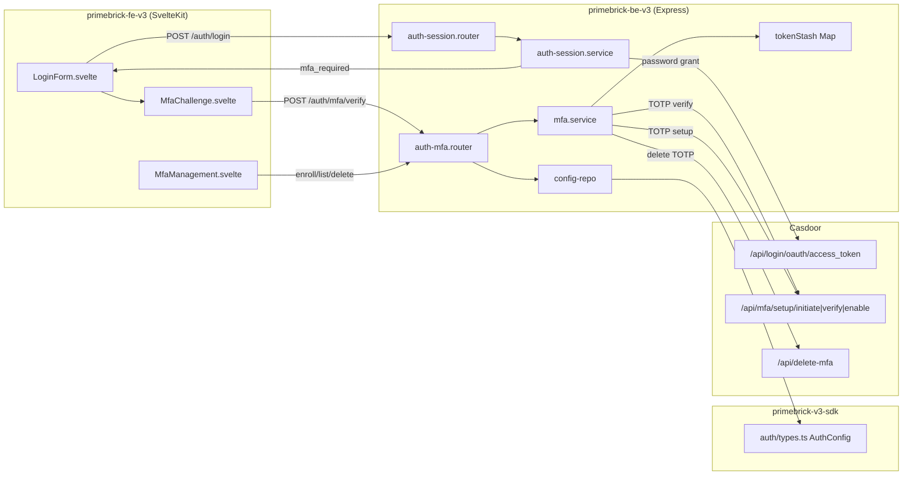
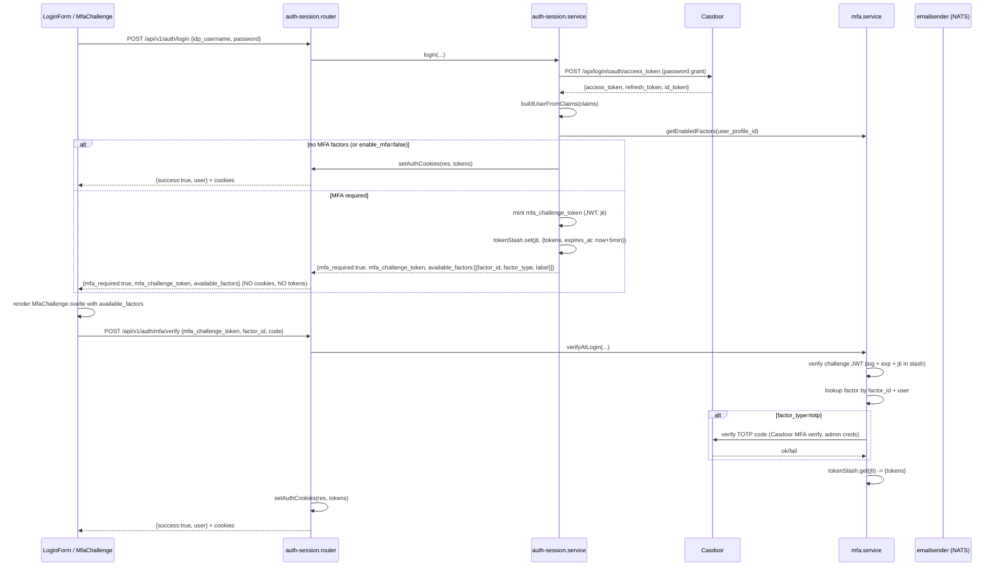
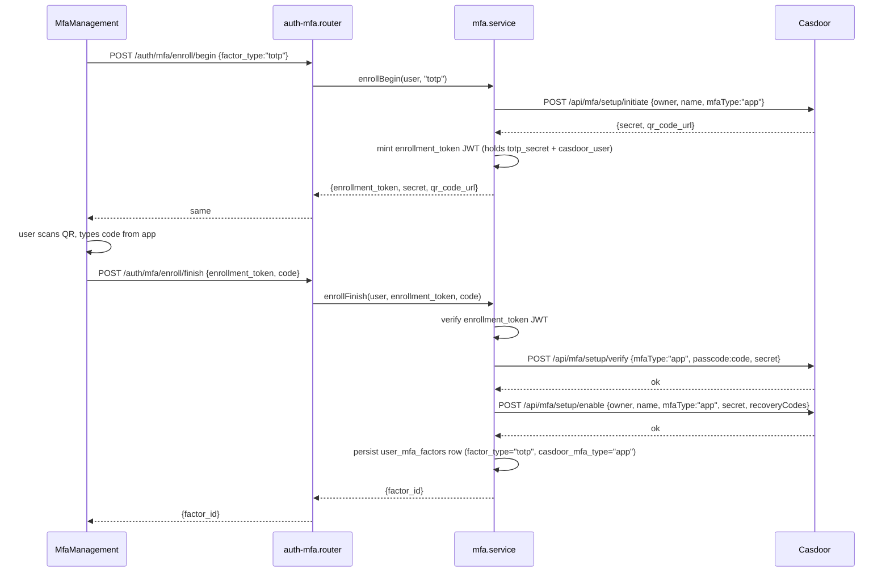
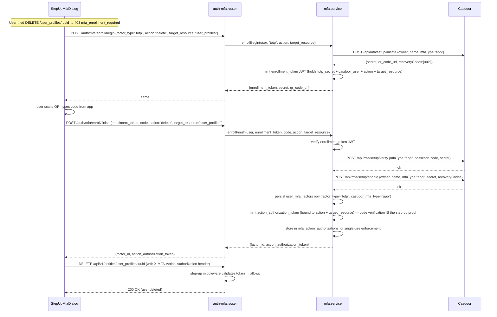

# Primebrick v3 — MFA / 2FA Implementation Plan

> Status: **Draft for implementation — revised 2026-07-19 (v3) after empirical codebase analysis + route-based step-up correction + Email OTP removal + three-surface model**
> Scope: Primebrick v3 platform (`primebrick-be-v3`, `primebrick-fe-v3`, `primebrick-v3-sdk`, `primebrick-us-v3`, `primebrick-v3-docs`, `primebrick-v3-website`)
> Author: AI planning agent
> Last updated: 2026-07-19

---

## 0. Revision history

| Date | Change | Evidence |
|---|---|---|
| 2026-07-19 v3 | **Step-up MFA is ROUTE-BASED, not admin-based.** Removed `is_admin` check from step-up middleware. Any user (admin or non-admin) hitting a `requires_mfa_step_up` route is challenged. `is_admin` only affects RBAC, not step-up. | User correction: "the is_admin flag in this flow is never used to enforce the MFA". |
| 2026-07-19 v3 | **Email OTP removed. TOTP only for v1.** Casdoor handles all credential validation. Email OTP would require either Casdoor's SMTP (bypasses our emailsender) or BE-side verification (breaks "Primebrick doesn't handle credentials" principle). | User decision: "we never talked about OTP via email... Primebrick doesn't handle credentials validation logic, it is all in charge of casdoor". |
| 2026-07-19 v3 | **Three-surface model for MFA UX.** Surface A: welcome onboarding PAGE (invitation-triggered, one-time, MFA optional). Surface B: enforcement security DIALOG (post-login, recurring, MFA optional alternative to passkey). Surface C: step-up at route time (the real enforcement, MFA mandatory). | User correction: "you are confusing the WELCOME ONBOARDING PAGE with the ENFORCEMENT SECURITY DIALOG". Empirical: `src/routes/welcome/+page.svelte` (exists), `PasskeyPromptDialog.svelte` (exists, mounted in app layout). |
| 2026-07-19 v3 | **Inline enrollment at step-up time.** When a user without MFA hits a step-up route, 403 returns `mfa_enrollment_required`. FE shows inline TOTP enrollment wizard. User scans QR → enters code once → factor created + action token issued → retry, no re-click. `enroll/finish` has a step-up mode that returns `action_authorization_token` directly. | User decision: "after the enrollment is completed, i would ask to the user to share the authenticator otp, if validated then it can be used to access the action and continue without re-click". |
| 2026-07-19 v3 | **`mfa_step_up_enabled` config key removed.** Redundant — `enable_mfa` controls both login MFA and step-up. If `enable_mfa=false`, the middleware passes through. The route metadata flag (`requires_mfa_step_up`) is a dev concern, always "on" as a feature. | User correction: "the way a dev define a route to be protected by MFA is a feature always on, why should i disable it?" |
| 2026-07-19 v3 | **MFA config keys reduced to 3.** `enable_mfa` (default "true"), `mfa_challenge_token_ttl_seconds` (default "300"), `mfa_challenge_signing_secret` (auto-generated). Removed `mfa_email_otp_*`, `mfa_recovery_codes_count`, `mfa_step_up_enabled`, `mfa_step_up_action_token_ttl_seconds`. | Consequence of Email OTP removal + step-up config simplification. |
| 2026-07-19 v3 | **`enable_mfa` must be "true" by default in initial seed + Casdoor setup script.** Added to `00000000000000_init_database.sql` + `scripts/setup-casdoor.ts` + fire-and-forget script for existing databases. | User requirement: "i want to enforce it". Empirical: `enable_mfa` not present in seed (lines 440-460 of init patch); `setup-casdoor.ts` sets `enable_formauth`/`enable_webauthn`/`passkey_required` to "true" (lines 339-341). |
| 2026-07-19 v3 | **`has_mfa` flag added to `GET /api/v1/auth/me` response.** Computed from `user_mfa_factors` count (same pattern as `has_passkey` from `user_passkeys`). Needed by enforcement dialog + step-up interceptor. | Empirical: `auth-session.service.ts` `getMe()` (lines 195-219) computes `has_passkey` via `UserPasskeysDal.countByUserProfileId()`. No `has_mfa` exists. |
| 2026-07-19 v3 | **PasskeyPromptDialog extended to offer MFA as alternative.** When `passkey_required=false`, dialog offers passkey OR MFA (TOTP) OR skip. When `passkey_required=true`, passkey only (mandatory). | User requirement: "if the passkey is not mandatory then the passkey and mfa can be choosed as auth method". Empirical: `PasskeyPromptDialog.svelte` (266 lines, mounted in app layout line 67). |
| 2026-07-19 v3 | **"Link no longer valid" dedicated error page.** New `src/routes/welcome/+error.svelte` for invalid/expired/used invitation tokens. Not the generic 404. | User requirement: "do not use the 404 page, i want a dedicated generic error page". Empirical: no `+error.svelte` exists; welcome page uses in-page error cards (lines 287-303). |
| 2026-07-19 v3 | **Website + docs major expansion.** Website security sections updated with three-surface model. Docs split into multiple pages with Mermaid flow charts: onboarding flow, enforcement dialog, step-up MFA, invitation flow. | User requirement: "improve and enforce the concept of protection... be very detailed and if the page become too huge split in more sub-pages". Empirical: website `index.astro` has security sections (lines 740-823); docs use Zudoku + Mermaid; `authentication-mfa.mdx` is 70 lines (shallow). |
| 2026-07-19 v2 | **Step-up MFA moved from §1.5 future plan to IN-SCOPE.** Login MFA + step-up MFA ship in the same release. | User decision: "Same release". |
| 2026-07-19 v2 | **Recovery codes removed.** No recovery code generation, storage, or UI. Admin reset is the recovery path. | User decision: "No recovery codes". |
| 2026-07-19 v2 | **Casdoor v3.118.0 MFA APIs verified stateless.** All setup/verify/enable/delete/set-preferred endpoints use `object.GetUser(userId)` with admin credentials — NO Beego session required. Phase 0 spike risk dramatically reduced. | `controllers/mfa.go` source verified; PR #3382 merged; Casdoor upgraded v3.75.0→v3.118.0 in commit `2cf6bda`. |
| 2026-07-19 v2 | **mfaType corrected: `"app"` not `"totp"`.** Casdoor's `object.TotpType` constant = `"app"`. Internal `factor_type` column stays `'totp'` (our naming); `casdoor_mfa_type` column stores `'app'`. | `controllers/mfa.go` line 1: `@Param mfaType formData string true "The type of MFA to set up (app/sms/email)"`. |
| 2026-07-19 v2 | **WebAuthn/Passkey fully shipped.** Signin, signup, sync-passkeys, PG tracking, notification emails, `passkey_required` enforcement flag, `PasskeyPromptDialog` persistent UX — all production-ready. | Commits `4d8b1e3`, `70b86d3`, `2cf6bda`; `webauthn.service.ts` (1035 lines); `PasskeyPromptDialog.svelte` (266 lines). |
| 2026-07-19 v2 | **FE testing stack shipped.** Vitest + Playwright + axe-core. E2E auth specs with WebAuthn virtual authenticator, fake Brevo, PG helpers. | Commits `2c979b6`, `0991bb0`; `src/e2e/auth-passkey.spec.ts`. |

---

## 1. Objective & Scope

### 1.1 Goal

Add Multi-Factor Authentication (MFA / 2FA) to the Primebrick v3 platform with two complementary layers:

1. **Login MFA** — a user logging in with username + password must additionally prove possession of a second factor before the backend issues session tokens and sets auth cookies.
2. **Step-up MFA (transaction authorization)** — an admin performing mutating actions (CREATE/UPDATE/DELETE/restore) on **authoritative entities** must re-authenticate with MFA for each action. This defends against session hijacking: a stolen admin cookie alone cannot create users, organizations, roles, or modify system config.

Both layers ship in the **same release**. They share the same `user_mfa_factors` table, the same TOTP verification logic, and the same challenge-token JWT pattern.

### 1.2 Supported factors

| Factor | Type | Backend | Rationale |
|---|---|---|---|
| **TOTP** (authenticator app, RFC 6238) | Primary & only | Casdoor `/api/mfa/*` (proxied, stateless — verified v3.118.0) | Standard, offline, no per-user cost, no PII collection. Casdoor stores the secret and verifies the code — Primebrick never handles credential validation. Universal: Google Authenticator, Microsoft Authenticator, Authy, etc. — all free, all cross-platform. |

**No Email OTP.** Email OTP was considered and rejected because:
- If via Casdoor: Casdoor sends the email using its own SMTP config, bypassing our `emailsender` microservice — we lose branding, templates, tracking, Brevo analytics, and the fire-and-forget NATS pattern.
- If via Primebrick BE-side: Primebrick generates the code, hashes it, sends via `emailsender`, and verifies the hash — this breaks the principle that "Primebrick doesn't handle credentials validation logic, it is all in charge of Casdoor."
- TOTP authenticator apps are universal and free. The step-up inline enrollment means users can install one on the spot.

**No recovery codes.** If a user loses their TOTP device, an admin can manually reset MFA by deleting their `user_mfa_factors` rows (and Casdoor-side TOTP via `/api/delete-mfa`). This is documented as an admin runbook.

### 1.3 Explicitly excluded

- **SMS** — excluded. Reasons: per-message cost via Brevo, GDPR/phone-number collection concerns, phone numbers are not currently stored on `user_profiles`, and deliverability is unreliable. Can be revisited as a later phase if a business case appears.
- **Passkey as 2nd factor** — excluded. Casdoor treats WebAuthn/passkey as **passwordless 1FA**, not as a second factor on top of a password. Mixing the two models would create ambiguous UX and double-gate users who already have a strong factor.
- **WebAuthn signin is NOT MFA-gated.** A passkey signin already proves possession of a hardware-backed credential — it **bypasses** the MFA challenge entirely. MFA only gates the **password** login path. This is documented explicitly in §3.

### 1.4 Non-goals (this phase)

- No SMS factor.
- No Email OTP factor (TOTP only — see §1.2).
- No recovery codes (admin reset is the recovery path — see §1.2).
- No per-org / per-role mandatory MFA policy — global `enable_mfa` switch only. Per-org policy is a follow-up.
- Step-up MFA applies to **all users** hitting a `requires_mfa_step_up` route (not just admins). Extending to additional entities beyond the 6 authoritative ones is a follow-up.

### 1.5 Step-up MFA for admin actions on authoritative entities (IN SCOPE)

> **This section was previously a "future reminder". It is now IN SCOPE and ships in the same release as login MFA.**

**Problem:** The Primebrick FE settings pages use a **two-click destructive-action confirmation pattern** (`variant="destructive"` button + inline "are you sure?" toggle). This protects against **accidental clicks** but NOT against **session hijacking** — an attacker who steals an admin's session cookie can perform any destructive action without the second factor. Verified empirically: 7 destructive dialogs exist today:

| FE page | Destructive action | Line |
|---|---|---|
| `settings/security/+page.svelte` | Delete account | 295-304 |
| `settings/email-providers/+page.svelte` | Delete provider | 335-347 |
| `settings/modules/+page.svelte` | Delete module | 359 |
| `settings/roles/[idp_role]/+page.svelte` | Delete role (NEW, commit `215282d`) | 316 |
| `settings/templates/+page.svelte` | Delete template | 149 |
| `settings/users/create/+page.svelte` | Destructive user op | 504 |
| `settings/organizations/create/+page.svelte` | Destructive org op | 312 |

**Key insight (user-identified):** CREATE is often MORE dangerous than DELETE. A hacker who can CREATE a user can create a backdoor account with admin role → **persistent undetectable access**. A hacker who can UPDATE a user can escalate privileges. A hacker who can DELETE causes visible damage but can't persist. Therefore step-up MFA must protect **ALL mutating routes** (CREATE/UPDATE/DELETE/restore) on authoritative entities, not just DELETE.

**Authoritative entities (6):** `user_profiles`, `organizations`, `role_mappings`, `auth_configurations`, `email_providers`, `modules`. These 6 control system access, identity, permissions, and communication channels. Compromising them compromises everything else.

**Design — metadata-driven route enforcer:**

1. **Route metadata flag**: devs add `requires_mfa_step_up: true` to ALL mutating routes (CREATE/UPDATE/DELETE/restore) on the 6 authoritative entities when calling `registerRoutes()`. This is a **dev concern** — the dev who defines the module/entity/endpoints decides which routes need step-up protection. No central whitelist to maintain.

2. **BE middleware** (`mfa-step-up.middleware.ts`): runs AFTER RBAC. Logic:
   - If `enable_mfa` is false → skip (MFA system is globally off).
   - If route metadata does NOT have `requires_mfa_step_up: true` → skip.
   - If valid `X-MFA-Action-Authorization` header present → validate token (action match, not expired, not used) → allow.
   - If no valid token → return **403** with `internal_code` depending on user's MFA state:
     - User HAS ≥1 enabled MFA factor → `mfa_step_up_required` (FE shows challenge UI)
     - User has NO MFA factor → `mfa_enrollment_required` (FE shows inline enrollment wizard)
   - Both 403 responses include `{ action, target_resource }` in the body so the FE can initiate the appropriate flow.
   - **No `is_admin` check.** Step-up is route-based, not user-based. Any user (admin or non-admin) hitting a `requires_mfa_step_up` route is challenged. `is_admin` only affects RBAC (permission bypass), not step-up.

3. **Step-up flow — user HAS MFA:**
   - FE calls `POST /api/v1/auth/mfa/step-up/initiate` with `{ action, target_resource }`.
   - BE verifies the user has ≥1 enabled MFA factor, mints a **step-up challenge JWT** (with `action` + `target_resource` claims binding it to the specific operation — prevents replay on a different action).
   - FE shows `MfaChallenge.svelte` (reused from login) inline, replacing the confirm button.
   - User enters TOTP code → `POST /api/v1/auth/mfa/step-up/verify` with the step-up token + code.
   - BE verifies the code via Casdoor, returns a **single-use action authorization token** (TTL = `mfa_challenge_token_ttl_seconds`, bound to `action` + `target_resource`).
   - FE performs the mutating call with the action authorization token in the `X-MFA-Action-Authorization` header.
   - BE middleware validates the header + action binding before executing.

4. **Step-up flow — user has NO MFA (inline enrollment):**
   - FE calls `POST /api/v1/auth/mfa/enroll/begin` with `{ factor_type: "totp", action, target_resource }` (step-up mode).
   - BE calls Casdoor `MfaSetupInitiate`, returns `{ enrollment_token, secret, qr_code_url }`.
   - FE shows inline enrollment wizard (scan QR → enter TOTP code).
   - User scans QR → enters TOTP code from authenticator app.
   - FE calls `POST /api/v1/auth/mfa/enroll/finish` with `{ enrollment_token, code, action, target_resource }` (step-up mode).
   - BE verifies the code via Casdoor (this IS the step-up proof — the user just proved possession of the factor), creates the `user_mfa_factors` row, AND issues an action authorization token in the same response.
   - FE performs the mutating call with the action authorization token — **no re-clicking the confirm button.** The user enters the TOTP code once; enrollment + step-up + action execution happen in sequence.

5. **Every action = fresh challenge (no remember window).** A user creating 10 users does 10 MFA challenges. Maximum security, higher friction. This is a deliberate trade-off: authoritative entities are high-value targets where the friction is acceptable.

6. **No permission changes.** Existing `USERS_DELETE_SINGLE`, `ROLE_MAPPINGS_DELETE`, `ORGANIZATIONS_DELETE_SINGLE`, etc. stay as-is. The step-up middleware is a **separate layer on top of RBAC**. RBAC determines who can access the route; step-up determines who can execute the action without re-authentication. A non-admin with `USERS_DELETE_SINGLE` permission can see the delete button and click it — but they must also pass step-up MFA to execute the deletion.

**Why this is a critical security win:** it converts the existing "click twice" confirmation (which protects against accidental clicks but NOT session hijacking) into a true **transaction authorization** step that defeats session hijacking. An attacker who steals a session cookie still cannot create users, delete organizations, or modify role mappings without the second factor — regardless of whether the session belongs to an admin or a non-admin with permissions. This is exactly NIST SP 800-63B §4.2.2 (reauthentication for privileged transactions) and CISA Zero Trust Maturity Model "Optimal" tier (session-based, action-tailored authorization for privileged access).

---

## 2. Architecture Overview

### 2.1 Why BE-side MFA challenge (critical constraint)

The existing auth architecture is a **BE-proxy pattern**: the frontend **never** talks to Casdoor directly. Login today uses Casdoor's **OAuth password grant** (`POST /api/login/oauth/access_token`), which exchanges username+password for access/refresh tokens in a single round-trip.

**Casdoor's MFA challenge only fires on the interactive login-page flow**, not on the OAuth password grant. Therefore the password grant **cannot** trigger Casdoor's MFA challenge. Primebrick must implement the MFA challenge **itself** on the BE, using Casdoor only as:

1. The **TOTP factor storage/verification backend** (setup/initiate → verify → enable; code verification at login via Casdoor's MFA verify endpoint), and
2. The **identity/password verifier** (password grant still proves the first factor).

The BE issues a short-lived **MFA challenge JWT** after the password is verified but before MFA verification, and only exchanges/sets the real session tokens once the second factor is verified.

**Casdoor v3.118.0 MFA APIs — verified stateless (2026-07-19):** All MFA setup/management endpoints use `object.GetUser(userId)` with admin credentials — NO Beego session required. This was the main Phase 0 spike risk; it is now resolved. Verified from `controllers/mfa.go` source:

| Endpoint | Auth mechanism | Stateless? |
|---|---|---|
| `POST /api/mfa/setup/initiate` | `object.GetUser(owner/name)` — admin creds | YES |
| `POST /api/mfa/setup/verify` | Takes `secret` as form param (PR #3382 merged) | YES |
| `POST /api/mfa/setup/enable` | `object.GetUser(owner/name)` + `secret`/`dest`/`recoveryCodes` form params | YES |
| `POST /api/delete-mfa/` | `object.GetUser(owner/name)` | YES |
| `POST /api/set-preferred-mfa` | `object.GetUser(owner/name)` | YES |

**BUT:** There is **NO stateless MFA verification at login**. Casdoor's password grant does NOT trigger MFA (Issue #3450 still open). This **confirms** the BE-side MFA challenge approach is correct — we verify TOTP BE-side using the secret from `user_mfa_factors` (or via Casdoor's verify endpoint with admin creds).

**mfaType values:** Casdoor uses `mfaType` = `"app"` (TOTP), `"sms"`, `"email"`, `"radius"`, `"push"`. The constant `object.TotpType` = `"app"`. Our internal `factor_type` column uses `'totp'` (our naming); the `casdoor_mfa_type` column stores `'app'` (Casdoor's naming).

### 2.2 Component diagram



### 2.3 Key architectural decisions

| Decision | Choice | Why |
|---|---|---|
| Where to run MFA challenge | BE-side | OAuth password grant cannot trigger Casdoor MFA (see §2.1). |
| How to bridge password-OK → MFA-verify | Short-lived BE-issued **MFA challenge JWT** | Stateless, survives BE restart better than a pure in-memory map; the Casdoor tokens are stashed in a `tokenStash` map keyed by the JWT `jti` (same pattern as `webauthn.service.ts` `sessionRelay`). |
| TOTP secret storage | Rely on Casdoor (do **not** store `totp_secret` in Primebrick DB) | Casdoor already stores it; avoids a second secret-at-rest + key-management burden. `totp_secret_encrypted` column is reserved/nullable for future use but left null in v1. |
| Recovery codes | **None.** Admin reset is the recovery path. | User decision 2026-07-19. Avoids storage/UX complexity + secondary secret-at-rest. If user loses all factors, admin deletes `user_mfa_factors` rows + Casdoor-side TOTP. |
| Email OTP delivery | **N/A — Email OTP removed.** TOTP only. | User decision 2026-07-19 v3. Casdoor handles all credential validation; Email OTP would break this principle. |
| Passkey signin MFA | Bypassed | Passkey is already a strong factor; gating it would be redundant and harmful UX. |
| Step-up MFA scope | **All users**, 6 authoritative entities, ALL mutating routes, every action = fresh challenge | User correction 2026-07-19 v3: route-based, not admin-based. `is_admin` only affects RBAC. |
| Step-up trigger mechanism | **Route metadata flag** `requires_mfa_step_up: true` + BE middleware | Dev-defined per route; no central whitelist. Middleware runs after RBAC. `enable_mfa=false` → middleware passes through. |
| Inline enrollment at step-up | When user has no MFA and hits a step-up route → `mfa_enrollment_required` → FE shows inline TOTP enrollment → code verified = step-up proof → action token issued → no re-click | User decision 2026-07-19 v3. |
| Casdoor MFA API auth | Admin credentials (clientId/clientSecret) — stateless | Verified v3.118.0: all endpoints use `object.GetUser(userId)`, no session needed. |
| `enable_mfa` default | `"true"` — enforced by default in initial seed + Casdoor setup script | User requirement 2026-07-19 v3: "i want to enforce it". |

---

## 2a. MFA Enforcement & Compliance Standards

### 2a.1 The three-surface model

Primebrick enforces MFA through **three distinct UX surfaces**, each with a different purpose and enforcement level. MFA is **never mandatory per user** — it is **mandatory per route action**. A user who never touches a step-up-protected route can live without MFA forever.

#### Surface A — Welcome Onboarding PAGE (invitation-triggered, one-time)

**What:** the `/welcome` page that invited users see after clicking the email invitation link. Already exists at `src/routes/welcome/+page.svelte`.

**Who sees it:** invited users (admin or non-admin) who click the invitation link. The first setup admin (created directly in Casdoor, no invitation) does NOT see this page.

**When:** once, after clicking the invitation link. If the link is clicked again after completion → dedicated "link no longer valid" error page (new `src/routes/welcome/+error.svelte` — NOT the generic 404).

**What it contains (currently):**
- Password setup with password policy validation
- OTP verification (6-digit code sent to email — this is the invitation OTP, NOT MFA)
- Passkey information (informational only — actual enrollment happens after login because WebAuthn endpoints require an authenticated session)

**What it contains (after this plan):**
- Same as above, PLUS an optional MFA (TOTP) enrollment step
- MFA is **always optional** here — never mandatory. The user can skip it.
- Passkey enrollment is mandatory here ONLY if `passkey_required=true` (existing behavior — but currently passkey enrollment happens post-login, not on the welcome page, because WebAuthn requires an authenticated session)

**MFA mandatory?** **Never.** This is a proactive UX nudge, not enforcement.

**Empirical evidence:** `src/routes/welcome/+page.svelte` (471 lines), state machine: `loading → verify → otp-sent → otp-verified → complete → error`. Token passed via URL fragment (`#token=xxx`). BE endpoints: `POST /api/v1/auth/welcome/verify|send-otp|verify-otp|complete`. After completion: `onboarding_completed=true` set on `user_profiles` (BE `invitation.service.ts` line 486). Redirects to `/login`.

#### Surface B — Enforcement Security DIALOG (post-login, recurring)

**What:** a dialog that appears after login if the user has no advanced authentication method (no passkey AND no MFA). Already exists as `PasskeyPromptDialog.svelte`, mounted in `src/routes/(app)/+layout.svelte` line 67.

**Who sees it:** any logged-in user who has `has_passkey === false` AND `has_mfa === false`.

**When:** after every login, UNLESS the user has at least one advanced method OR has flagged "do not show again".

**Behavior depends on `passkey_required` auth config:**

| `passkey_required` | Dialog behavior | MFA offered? |
|---|---|---|
| `true` | **Mandatory** — user MUST enroll a passkey. No skip, no "do not show again". Dialog is persistent (no ESC, no click-outside). | No — passkey satisfies the advanced login requirement. MFA is not offered here. |
| `false` | **Dismissible** — user can choose: enroll passkey, enroll MFA (TOTP), skip, or "do not show again". All skippable. | Yes — MFA is offered as an alternative to passkey. |

**MFA mandatory?** **Never.** Even when offered, it's always skippable. The user can dismiss indefinitely (with "do not show again" checkbox that persists to `passkey_prompt_dismissed` on `user_profiles`).

**Extension needed:** the current `PasskeyPromptDialog.svelte` only offers passkey. It needs to be extended (or wrapped in a new `AdvancedAuthDialog.svelte`) to also offer MFA (TOTP) as an alternative when `passkey_required=false`. The `shouldShow` condition needs to also check `has_mfa` (new field, computed from `user_mfa_factors` count, added to `GET /api/v1/auth/me` response).

**Empirical evidence:** `PasskeyPromptDialog.svelte` (266 lines). Auto-opens via `$effect` when `shouldShow` becomes true. `shouldShow = webauthnEnabled && webauthnSupported && !!profile?.uuid && profile?.has_passkey === false && (passkeyRequired || !profile?.passkey_prompt_dismissed)`. Dismissal persists via `POST /api/v1/auth/me/dismiss-passkey-prompt`.

#### Surface C — Step-up MFA at route time (the real enforcement)

**What:** when ANY user (admin or non-admin) calls a mutating API route (CREATE/UPDATE/DELETE/restore) on one of the 6 authoritative entities, the BE middleware requires a valid `X-MFA-Action-Authorization` header. If missing → 403. This is the ONLY place MFA is truly mandatory.

**Who sees it:** any user hitting a route with `requires_mfa_step_up: true` metadata. Not limited to admins.

**When:** at the moment the API call is made (after RBAC passes).

**Two sub-flows depending on user's MFA state:**

| User state | 403 `internal_code` | FE response |
|---|---|---|
| Has ≥1 enabled MFA factor | `mfa_step_up_required` | Show `MfaChallenge.svelte` inline → user enters TOTP → action token → retry |
| Has NO MFA factor | `mfa_enrollment_required` | Show inline TOTP enrollment wizard → user scans QR → enters code once → factor created + action token issued → retry (no re-click) |

**MFA mandatory?** **YES.** This is the only surface where MFA cannot be skipped. If you want to perform a mutating action on an authoritative entity, you MUST have MFA — and if you don't, you'll be forced to enroll it inline.

**This is what makes MFA a platform guarantee, not a user preference.** A user can skip MFA at onboarding (Surface A), skip it at the post-login dialog (Surface B), but they CANNOT skip it when they try to delete a user, create an organization, or modify role mappings (Surface C).

#### Summary table

| Surface | What | Passkey mandatory? | MFA mandatory? | Who |
|---|---|---|---|---|
| A — Welcome onboarding PAGE | `/welcome` (invitation-triggered, one-time) | If `passkey_required=true` | Never (optional step) | Invited users |
| B — Enforcement security DIALOG | Post-login, recurring | If `passkey_required=true` | Never (optional alternative to passkey) | All logged-in users without advanced method |
| C — Step-up at route time | API middleware on `requires_mfa_step_up` routes | N/A (passkey is login, not transaction auth) | **YES** — if route has `requires_mfa_step_up: true` | All users hitting the route |

#### The first setup admin (special case)

The first admin (created directly in Casdoor, no invitation):
1. Skips Surface A (no invitation link)
2. Logs in with username/password
3. Hits Surface B (enforcement dialog) — if `passkey_required=true`, must enroll passkey; if false, can skip everything
4. When they try to do something sensitive (delete a user, create an org) → hits Surface C → forced to enroll MFA inline if they don't have it

#### Last-factor guard (removed)

The previous plan had a "last-factor guard" that prevented admins from deleting their last MFA factor. This is **removed** because step-up is now route-based, not admin-based. If a user (admin or not) deletes their last MFA factor, they simply won't be able to perform step-up-protected actions until they re-enroll. This is self-enforcing via Surface C.

### 2a.2 Compliance standards — empirical mapping (verified 2026-07-17)

The "administrators must use MFA" requirement is mandated by **three independent, widely-recognized frameworks**. Primebrick's enforcement model maps cleanly onto all three. This is a legitimate, defensible marketing claim for the website.

| Framework | Specific clause | What it requires | How Primebrick satisfies it | Source (verified) |
|---|---|---|---|---|
| **EU NIS2 Directive (2022/2555)** | **Article 21.2(j)** — "the use of multi-factor authentication or continuous authentication solutions … within the entity, where appropriate" | MFA must be in the cybersecurity risk-management measures. ENISA's technical implementation guidance §11.3 ("Privileged accounts and system administration accounts") explicitly requires "strong identification, authentication such as **multi-factor authentication**, and authorisation procedures for **privileged accounts** and system administration accounts". | `enable_mfa=true` by default + step-up MFA at route time (Surface C) ensures MFA is enforced for all sensitive actions. The three-surface model (§2a.1) provides layered enforcement. | EUR-Lex CELEX:32022L2555; ENISA technical implementation guidance v1.0 §11.3, §11.6, §11.7 |
| **ISO/IEC 27001:2022** | **Annex A.8.5 (Secure Authentication)** + **A.8.2 (Privileged access rights)** | A.8.5 requires secure authentication mechanisms (MFA explicitly named by auditors as the expected implementation). A.8.2 requires privileged accounts to use **stronger authentication than standard users — MFA is mandatory, not optional, for admin access**. A.5.17 governs the credential lifecycle that MFA factors fall under. | Step-up MFA at route time (Surface C) ensures MFA is enforced for all privileged actions on authoritative entities. The three-surface model (§2a.1) provides layered enforcement. | ISO 27001:2022 Annex A.8.5, A.8.2, A.5.17 (verified via TCSA, WatchDog Security, iso27001.com) |
| **CISA Zero Trust Maturity Model v2.0** (US federal baseline, OMB M-22-09) | **Identity pillar, "Advanced" → "Optimal" maturity** | "Advanced" tier: enterprise authenticates identity using MFA. "Optimal" tier: **phishing-resistant MFA** (FIDO2/WebAuthn) for all access, session-based + action-tailored authorization for privileged access requests. | v1 MFA (TOTP) satisfies "Advanced". The existing **WebAuthn/passkey** support (already shipped) satisfies "Optimal" phishing-resistant MFA. **Step-up MFA (§1.5, IN SCOPE)** satisfies "Optimal" action-tailored authorization for privileged access. | CISA Zero Trust Maturity Model v2.0 (April 2023); OMB M-22-09 (Jan 2022) |

**Additional alignment (secondary, supporting):**

| Framework | Clause | Note |
|---|---|---|
| **NIST SP 800-63B** (US federal digital identity) | §4.2.2 "Reauthentication" + §A.3 "Multi-factor authentication" | Recommends reauthentication (step-up) for privileged transactions. Maps to the §1.5 step-up follow-up. TOTP is an acceptable AAL2 authenticator. |
| **PCI DSS v4.0** | Requirement 8.4.1 / 8.4.2 | MFA required for all access into the CDE and for all remote access. Relevant if a Primebrick customer processes card data. |
| **SOC 2 (TSC 2017, CC6.1)** | CC6.1 — logical access controls | MFA for privileged access is a standard auditor expectation. |

### 2a.3 Marketing claim (for website + docs)

The following claim is **empirically defensible** and should be used on the website and in the docs:

> **Primebrick enforces Multi-Factor Authentication for all sensitive administrative actions by default** — aligned with **EU NIS2 Directive (Art. 21.2.j + ENISA §11.3 privileged accounts)**, **ISO/IEC 27001:2022 (Annex A.8.5 Secure Authentication + A.8.2 Privileged access rights)**, and the **CISA Zero Trust Maturity Model v2.0**. MFA is mandatory per route action (not per user): any user performing mutating operations on authoritative entities (users, organizations, role mappings, auth config, email providers, modules) must re-authenticate with MFA for each action. Passkey (WebAuthn / FIDO2) signin provides **phishing-resistant MFA** at the CISA "Optimal" tier. The three-surface model (onboarding nudge → post-login dialog → route-level enforcement) provides layered, defense-in-depth MFA adoption.

**Where to publish:**

| Surface | File | What to add |
|---|---|---|
| Website (marketing) | `primebrick-v3-website/src/pages/[lang]/index.astro` (security/compliance section, near the existing WebAuthn mention around lines 593/635/637) | A "Compliance" or "Security" block with the claim above + the three framework badges/logos (NIS2, ISO 27001, CISA ZTMM). |
| Docs (developer-facing) | `primebrick-v3-docs/pages/api/authentication.mdx` (already mentions WebAuthn at lines 3, 8, 10, 55, 80, 86) | New subsection "MFA / 2FA" covering: the three-surface model, the route-based step-up policy, the three compliance frameworks, the BE endpoints, and the FE integration. |
| Docs (architecture) | `primebrick-v3-docs/pages/getting-started/architecture.mdx` (already references Casdoor at lines 38, 46, 69) | One paragraph on MFA in the auth architecture section. |
| Docs (new pages) | `primebrick-v3-docs/pages/getting-started/authentication-mfa.mdx` (expand) + `authentication-onboarding.mdx`, `authentication-security-dialog.mdx`, `authentication-step-up.mdx` (new) | Dedicated MFA pages: three-surface model, TOTP-only factor, route-based step-up, inline enrollment, compliance mapping table (§2a.2 above). Mermaid flow charts. Update `zudoku.config.tsx` navigation. |
| BE repo internal | `primebrick-be-v3/AGENTS.md` | Add a short "MFA / 2FA" subsection under the RBAC section documenting the route-based step-up enforcement rule + `enable_mfa=true` default + step-up metadata flag so future agents preserve it. |

**IMPORTANT — do NOT claim certification.** Primebrick is *aligned with* / *implements controls from* these frameworks. Claiming "ISO 27001 certified" or "NIS2 certified" requires a formal audit by an accredited body. The marketing copy must say "aligned with" / "implements the MFA controls required by" — never "certified". This distinction is enforced in the docs editorial rules.

---

## 3. MFA Challenge Flow at Login

### 3.1 Sequence — password login with MFA enabled



### 3.2 Endpoints (login-side)

| Method | Path | Auth | Body | Response |
|---|---|---|---|---|
| `POST` | `/api/v1/auth/login` | `PUBLIC` | `{idp_username, password}` (existing) | **unchanged** if no MFA: `{success, user}` + cookies. **New** if MFA: `{mfa_required:true, mfa_challenge_token, available_factors:[{factor_id, factor_type, label}]}`, no cookies. |
| `POST` | `/api/v1/auth/mfa/verify` | `PUBLIC` (challenge-token gated) | `{mfa_challenge_token, factor_id, code}` | `{success:true, user}` + cookies, OR `{error}` with `internal_code` for bad code / expired / no factor. |

> **Note:** the `/api/v1/auth/mfa/send` endpoint (for Email OTP resend) is **removed** — TOTP only, no email OTP to resend.

### 3.3 WebAuthn / passkey signin — explicit bypass

`POST /api/v1/auth/webauthn/signin/begin|finish` is **unchanged**. Passkey signin never enters the MFA challenge flow. A user with both a passkey and MFA factors can sign in with the passkey and skip MFA. This is intentional and must be documented in the FE UI ("Passkey sign-in bypasses MFA — your passkey is already a strong factor").

---

## 4. MFA Enrollment Flow (authenticated user, profile page + inline step-up)

All enrollment endpoints require `rbacHandler([Permission.AUTHENTICATED_USER])`.

### 4.1 Endpoints

| Method | Path | Body | Response |
|---|---|---|---|
| `POST` | `/api/v1/auth/mfa/enroll/begin` | `{factor_type:"totp", action?, target_resource?}` | `{enrollment_token, secret, qr_code_url}`. If `action` + `target_resource` present → step-up mode (inline enrollment). |
| `POST` | `/api/v1/auth/mfa/enroll/finish` | `{enrollment_token, code, action?, target_resource?}` | Normal mode: `{factor_id}`. Step-up mode (with `action` + `target_resource`): `{factor_id, action_authorization_token}` — the code verification IS the step-up proof, so the action token is issued directly. |
| `GET` | `/api/v1/auth/mfa/factors` | — | `[{factor_id, factor_type, label, is_enabled, is_preferred, last_used_at}]` |
| `DELETE` | `/api/v1/auth/mfa/factors/:id` | — | `{deleted:true}`. Calls Casdoor `/api/delete-mfa`. |
| `POST` | `/api/v1/auth/mfa/factors/:id/set-preferred` | — | `{ok:true}` — sets `is_preferred=true` for this factor and `false` for all others of the same user. |

### 4.2 TOTP enrollment sequence



> **Note on `recoveryCodes` in `MfaSetupEnable`:** Casdoor's `MfaSetupEnable` requires a `recoveryCodes` form param (it throws "recovery codes is missing" if absent). The BE passes the recovery code that Casdoor generated in `MfaSetupInitiate` (which returns `recoveryCodes: [uuid]`). We do NOT store or display this code to the user — it exists only to satisfy Casdoor's API contract. If a user loses all factors, admin reset is the path (§1.2).

### 4.3 Step-up inline enrollment sequence (user has NO MFA, hits a step-up route)



> **The user enters the TOTP code ONCE.** The enrollment verification IS the step-up challenge. No re-clicking the confirm button. The `enroll/finish` endpoint in step-up mode (when `action` + `target_resource` are present in the request body) returns both `factor_id` AND `action_authorization_token` in the same response.

---

## 5. New DB Entity: `user_mfa_factors`

Mirror the `user_passkeys` pattern: Primebrick-managed metadata, FK to `user_profiles.id`, **not** soft-deletable, auditable fields, external exposure only via `uuid`.

### 5.1 Columns

| Column | Type | Nullable | Default | Notes |
|---|---|---|---|---|
| `id` | `SERIAL` / int PK | no | — | Internal PK, never exposed. |
| `uuid` | `uuid` | no | `gen_random_uuid()` | External identifier. Unique. |
| `user_profile_id` | int | no | — | FK → `user_profiles.id` ON DELETE CASCADE. |
| `factor_type` | `text` | no | — | `'totp'` (only value in v1 — TOTP only, no Email OTP). |
| `casdoor_mfa_type` | `text` | yes | null | Casdoor-side type string (`'app'` for TOTP). |
| `label` | `text` | yes | null | User-given label (e.g. "Google Authenticator"). |
| `is_enabled` | `boolean` | no | `true` | |
| `is_preferred` | `boolean` | no | `false` | Only one preferred per user (enforced in service). |
| `totp_secret_encrypted` | `text` | yes | null | Reserved for future "store secret locally" mode. **v1: always null** (rely on Casdoor). |
| `last_used_at` | `timestamptz` | yes | null | Updated on successful verify. |
| `created_at` | `timestamptz` | no | `now()` | Audit. |
| `created_by` | `int` | yes | null | Audit (user_profile_id of actor). |
| `updated_at` | `timestamptz` | no | `now()` | Audit. |
| `updated_by` | `int` | yes | null | Audit. |

**Indexes:** `unique(user_profile_id, factor_type, label)` where label is not null (optional, to prevent duplicate labels); `index(user_profile_id)`; `unique(uuid)`.

**Not soft-deletable** — matches `user_passkeys`. Deletion is a hard delete (with Casdoor `/api/delete-mfa` call for TOTP).

### 5.2 Entity sketch (`user_mfa_factor_entity.ts`)

```ts
import { Entity, PrimaryGeneratedColumn, Column, ManyToOne, Index, Unique, CreateDateColumn, UpdateDateColumn } from 'typeorm';
import { UserProfile } from './user_profile_entity';

export type MfaFactorType = 'totp';

@Entity({ name: 'user_mfa_factors' })
@Unique('uq_user_mfa_factors_uuid', ['uuid'])
@Index('idx_user_mfa_factors_user', ['user_profile_id'])
export class UserMfaFactor {
  @PrimaryGeneratedColumn({ type: 'int' })
  id!: number;

  @Column({ type: 'uuid', unique: true, generated: 'uuid' })
  uuid!: string;

  @ManyToOne(() => UserProfile, { onDelete: 'CASCADE' })
  user_profile!: UserProfile;

  @Column({ name: 'user_profile_id', type: 'int' })
  user_profile_id!: number;

  @Column({ name: 'factor_type', type: 'text' })
  factor_type!: MfaFactorType;

  @Column({ name: 'casdoor_mfa_type', type: 'text', nullable: true })
  casdoor_mfa_type!: string | null;

  @Column({ type: 'text', nullable: true })
  label!: string | null;

  @Column({ name: 'is_enabled', type: 'boolean', default: true })
  is_enabled!: boolean;

  @Column({ name: 'is_preferred', type: 'boolean', default: false })
  is_preferred!: boolean;

  @Column({ name: 'totp_secret_encrypted', type: 'text', nullable: true })
  totp_secret_encrypted!: string | null;

  @Column({ name: 'last_used_at', type: 'timestamptz', nullable: true })
  last_used_at!: Date | null;

  @CreateDateColumn({ name: 'created_at', type: 'timestamptz' })
  created_at!: Date;

  @Column({ name: 'created_by', type: 'int', nullable: true })
  created_by!: number | null;

  @UpdateDateColumn({ name: 'updated_at', type: 'timestamptz' })
  updated_at!: Date;

  @Column({ name: 'updated_by', type: 'int', nullable: true })
  updated_by!: number | null;
}
```

### 5.3 DB patch

New file `primebrick-be-v3/db-meta/patches/NNNN_create_user_mfa_factors.sql` (next sequential number — check `db-meta/patches/` for the current max before creating). Sketch:

```sql
CREATE TABLE user_mfa_factors (
  id SERIAL PRIMARY KEY,
  uuid UUID NOT NULL DEFAULT gen_random_uuid() UNIQUE,
  user_profile_id INT NOT NULL REFERENCES user_profiles(id) ON DELETE CASCADE,
  factor_type TEXT NOT NULL CHECK (factor_type IN ('totp')),
  casdoor_mfa_type TEXT,
  label TEXT,
  is_enabled BOOLEAN NOT NULL DEFAULT TRUE,
  is_preferred BOOLEAN NOT NULL DEFAULT FALSE,
  totp_secret_encrypted TEXT,
  last_used_at TIMESTAMPTZ,
  created_at TIMESTAMPTZ NOT NULL DEFAULT now(),
  created_by INT,
  updated_at TIMESTAMPTZ NOT NULL DEFAULT now(),
  updated_by INT
);

CREATE INDEX idx_user_mfa_factors_user ON user_mfa_factors(user_profile_id);

-- Config seeds (also added to 00000000000000_init_database.sql + fire-and-forget script)
INSERT INTO auth_configurations (key, value, description, created_by) VALUES
  ('enable_mfa', 'true', 'Abilita il sistema MFA/2FA: login MFA + step-up MFA per route protette (true/false).', 'system'),
  ('mfa_challenge_token_ttl_seconds', '300', 'TTL in secondi per i JWT MFA challenge (login, step-up, action authorization).', 'system')
ON CONFLICT (key) DO NOTHING;
```

> **Note on `mfa_challenge_signing_secret`:** This key is auto-generated on first boot if missing (same pattern as `notification_alert_secret` — 32 random bytes hex). It is NOT seeded in the initial patch because the value must be unique per installation. The `config-repo.ts` loader generates and persists it on first read if the DB value is empty.

> **Note on `enable_mfa` in the initial seed:** `enable_mfa` must ALSO be added to `00000000000000_init_database.sql` (the initial seed, lines 440-460) with default `"true"`, AND to `scripts/setup-casdoor.ts` (lines 339-341) alongside the existing `enable_formauth`/`enable_webauthn`/`passkey_required` lines. A fire-and-forget script must be created in `db-meta/fire-and-forget/` to update the patch registry SHA256 on existing databases (per `.devin/rules/patch-sha256-management.md` — never create a new initial patch, update the existing one).

After creating the entity + patch, run `pnpm run db:meta:compare` and resolve any drift, then `pnpm run db:migrate` to apply.

---

## 6. New Config Keys (`auth_configurations`)

| Key | Type | Default | Purpose |
|---|---|---|---|
| `enable_mfa` | text "true"/"false" | **"true"** | Master switch for the entire MFA system (login MFA + step-up MFA). When "false", login never branches to MFA, enrollment endpoints return 403, and the step-up middleware passes through. **Default "true" — enforced.** |
| `mfa_challenge_token_ttl_seconds` | numeric text | "300" | TTL of all BE-issued MFA JWTs: login challenge, step-up challenge, enrollment token, and action authorization token. One TTL for all — keeps it simple. |
| `mfa_challenge_signing_secret` | text | auto-generated | Secret used to sign all MFA JWTs. Auto-generated on first boot if missing (same pattern as `notification_alert_secret` — 32 random bytes hex). NOT seeded in the initial patch because the value must be unique per installation. |

> **Removed keys (v3):** `mfa_email_otp_expiry_minutes`, `mfa_email_otp_max_attempts` (Email OTP removed), `mfa_step_up_enabled` (redundant — `enable_mfa` controls both), `mfa_step_up_action_token_ttl_seconds` (reuses `mfa_challenge_token_ttl_seconds`), `mfa_recovery_codes_count` (recovery codes removed).

### 6.1 SDK `AuthConfig` update (`primebrick-v3-sdk/src/auth/types.ts`)

```ts
export interface AuthConfig {
  // ...existing fields...
  enable_webauthn: boolean;
  enable_formauth: boolean;
  passkey_required: boolean;
  enable_email_verification_check: boolean;
  // NEW — MFA (3 keys only)
  enable_mfa: boolean;
  mfa_challenge_token_ttl_seconds: number;
  mfa_challenge_signing_secret: string;
}
```

### 6.2 `AuthConfigPublic` (FE-facing, returned by `GET /api/v1/auth/config`)

```ts
export interface AuthConfigPublic {
  enable_formauth: boolean;
  enable_webauthn: boolean;
  passkey_required: boolean;
  enable_mfa: boolean;        // NEW — only this flag is public; TTLs/secrets are not
}
```

> **Note:** `mfa_step_up_enabled` is NOT in the public config. The FE does not need to know if step-up is enabled — it discovers this reactively when a 403 `mfa_step_up_required` or `mfa_enrollment_required` response is received. The `enable_mfa` flag is sufficient for the FE to know if MFA enrollment UI should be offered.

### 6.3 `config-repo.ts` updates

- Add the 3 new keys to `AuthConfigDb`.
- Parse `enable_mfa` with the same `"true"`/`"false"` → boolean coercion used for `enable_webauthn`.
- Parse `mfa_challenge_token_ttl_seconds` with `Number(value)`; mandatory-field check throws if missing.
- `mfa_challenge_signing_secret`: auto-generated if absent (like `notification_alert_secret` — 32 random bytes hex, persisted to DB on first read).
- `loadAuthConfigFromDb` must include the new fields.
- The public projection in the `GET /api/v1/auth/config` handler must add `enable_mfa`.

### 6.4 Initial seed + Casdoor setup script

- **`00000000000000_init_database.sql`** (lines 440-460): add `('enable_mfa', 'true', 'Abilita il sistema MFA/2FA: login MFA + step-up MFA per route protette (true/false).', 'system')` to the INSERT block. Update the patch in place (per `.devin/rules/patch-sha256-management.md` — never create a new initial patch).
- **`scripts/setup-casdoor.ts`** (lines 339-341): add `await updateAuthConfig(pbPool, "enable_mfa", "true", "setup-casdoor");` alongside the existing `enable_formauth`/`enable_webauthn`/`passkey_required` lines.
- **Fire-and-forget script** (`db-meta/fire-and-forget/update_init_patch_add_enable_mfa.sql`): INSERT the new key with `ON CONFLICT DO NOTHING` + update the SHA256 hash in `primebrick_database_patches` registry for the initial patch.

---

## 7. MFA Challenge Token (JWT) Design

### 7.1 Purpose

A short-lived, BE-signed JWT that proves "this user passed the password check but has not yet completed MFA." It is **not** an access token — it is accepted only by `POST /api/v1/auth/mfa/verify` (login) and `POST /api/v1/auth/mfa/step-up/verify` (step-up).

### 7.2 Claims

| Claim | Value | Notes |
|---|---|---|
| `iss` | `"primebrick-be"` | |
| `sub` | `user_profiles.uuid` | |
| `jti` | random UUID | Used as the key into `tokenStash` (login) or `actionAuthStash` (step-up). |
| `idp_code` | string | Carried so verify can rebuild Casdoor context if needed. |
| `idp_org` | string | |
| `idp_username` | string | |
| `available_factor_ids` | `string[]` (factor uuids) | Restricts which factors can be verified with this token. |
| `purpose` | `"login_challenge"` \| `"step_up_challenge"` | Distinguishes login MFA challenge from step-up MFA challenge. |
| `action` | string (optional) | Only for `purpose:"step_up_challenge"`. The action being authorized (e.g. `"create"`, `"update"`, `"delete"`, `"restore"`). Prevents replay on a different action. |
| `target_resource` | string (optional) | Only for `purpose:"step_up_challenge"`. The entity type being mutated (e.g. `"user_profiles"`, `"organizations"`). |
| `iat` | unix seconds | |
| `exp` | `iat + mfa_challenge_token_ttl_seconds` (default 300) | |

### 7.3 Signing

Signed with `mfa_challenge_signing_secret` (HS256). The secret is read from `auth_configurations`; if missing, the BE auto-generates one via `crypto.randomBytes(32).toString('hex')` and upserts it (same pattern as `notification_alert_secret`). **Never** expose this secret publicly.

### 7.4 Token stash (in-memory)

Same pattern as `webauthn.service.ts` `sessionRelay`:

```ts
const tokenStash: Map<string, { tokens: CasdoorTokens; expires_at: number }> = new Map();
const STASH_TTL_MS = 5 * 60 * 1000;
```

- On `login()` MFA branch: `tokenStash.set(jti, { tokens, expires_at: Date.now() + STASH_TTL_MS })`.
- On `verifyAtLogin()` success: `const { tokens } = tokenStash.get(jti)!; tokenStash.delete(jti);` then `setAuthCookies(res, tokens)`.
- A periodic sweep (or lazy sweep on access) evicts expired entries.

**Why stash instead of re-exchange:** avoids a second Casdoor round-trip (the password grant already happened; we don't want to re-send the password). The stash holds the already-issued tokens until MFA completes.

**Prod caveat (see §11):** in-memory map is per-process. Multi-instance BE deployments need Redis (or a shared store) for the stash. Flag for prod hardening.

### 7.5 Verify helper

```ts
// mfa-challenge-token.ts
import jwt from 'jsonwebtoken';
import { ApiError } from '../errors';

export interface MfaChallengePayload {
  jti: string;
  sub: string;          // user uuid
  idp_code: string;
  idp_org: string;
  idp_username: string;
  available_factor_ids: string[];
}

export function verifyMfaChallengeToken(token: string, secret: string): MfaChallengePayload {
  let payload: jwt.JwtPayload;
  try {
    payload = jwt.verify(token, secret, { algorithms: ['HS256'] }) as jwt.JwtPayload;
  } catch (e) {
    throw new ApiError('mfa_challenge_token_invalid', 401, 'MFA challenge token invalid or expired');
  }
  if (!payload.jti || !payload.sub || !Array.isArray(payload.available_factor_ids)) {
    throw new ApiError('mfa_challenge_token_invalid', 401, 'MFA challenge token malformed');
  }
  return {
    jti: payload.jti,
    sub: payload.sub,
    idp_code: payload.idp_code,
    idp_org: payload.idp_org,
    idp_username: payload.idp_username,
    available_factor_ids: payload.available_factor_ids,
  };
}
```

---

## 7a. Step-up MFA Architecture

### 7a.1 Route metadata flag

The `registerRoutes()` function (in `http/define-route.ts`) already accepts route metadata. We add an optional `requires_mfa_step_up: true` flag. Devs set this on mutating routes of the 6 authoritative entities.

**Authoritative entities (6) and their mutating routes (verified empirically from BE routers):**

| Entity | Route | Method | Current permission | Add flag? |
|---|---|---|---|---|
| `user_profiles` | `/api/v1/entities/user_profiles/:uuid` | PUT | `USER_PROFILES_UPDATE_SINGLE` | YES |
| `user_profiles` | `/api/v1/entities/user_profiles/:uuid/restore` | POST | `USER_PROFILES_RESTORE_SINGLE` | YES |
| `user_profiles` | `/api/v1/entities/user_profiles/:uuid/change-password` | POST | `AUTHENTICATED_ADMIN` | YES |
| `organizations` | `/api/v1/entities/organization` | POST | `ORGANIZATIONS_CREATE_SINGLE` | YES |
| `organizations` | `/api/v1/entities/organization/:uuid` | PUT | `ORGANIZATIONS_UPDATE_SINGLE` | YES |
| `organizations` | `/api/v1/entities/organization/:uuid` | DELETE | `ORGANIZATIONS_DELETE_SINGLE` | YES |
| `organizations` | `/api/v1/entities/organization/:uuid/restore` | POST | `ORGANIZATIONS_RESTORE_SINGLE` | YES |
| `role_mappings` | `/api/v1/system/role-mappings` | POST | `ROLE_MAPPINGS_CREATE` | YES |
| `role_mappings` | `/api/v1/system/role-mappings/:idp_role` | PUT | `ROLE_MAPPINGS_UPDATE` | YES |
| `role_mappings` | `/api/v1/system/role-mappings/:idp_role` | DELETE | `ROLE_MAPPINGS_DELETE` | YES |
| `auth_configurations` | (all upsert/update routes) | POST/PUT | `AUTHENTICATED_ADMIN` | YES |
| `email_providers` | (all mutating routes) | POST/PUT/DELETE | varies | YES |
| `modules` | (all mutating routes) | POST/PUT/DELETE | varies | YES |

> **Note:** The exact routes for `email_providers` and `modules` need to be verified during implementation — they may be in the US (microservices) or BE proxy routes. The dev implementing each module's router adds the flag when defining the route metadata.

### 7a.2 BE middleware (`mfa-step-up.middleware.ts`)

Runs AFTER `rbacHandler` (RBAC still applies — step-up is an additional layer). Logic:

```ts
// Pseudocode — see §13.8 for full sketch
export function mfaStepUpMiddleware(routeMeta: RouteMeta): RequestHandler {
  return asyncHandler(async (req, _res, next) => {
    // 1. Skip if MFA is globally disabled
    const cfg = await getAuthConfig();
    if (!cfg.enable_mfa) return next();

    // 2. Skip if route doesn't require step-up
    if (!routeMeta.requires_mfa_step_up) return next();

    // 3. NO is_admin check — step-up is route-based, not user-based.
    //    Any user (admin or non-admin) hitting a requires_mfa_step_up route
    //    must pass step-up. is_admin only affects RBAC (permission bypass).

    // 4. Check for valid action authorization token
    const actionToken = req.headers['x-mfa-action-authorization'] as string | undefined;
    if (!actionToken) {
      // Determine which 403 variant to return based on user's MFA state
      const hasMfa = await userHasEnabledMfaFactor(req.user!.id);
      const internalCode = hasMfa ? 'mfa_step_up_required' : 'mfa_enrollment_required';
      throw new ApiError(
        `/errors/${internalCode}`,
        hasMfa ? 'MFA step-up required for this action' : 'MFA enrollment required for this action',
        403,
        hasMfa
          ? 'This action requires step-up MFA verification. Provide an X-MFA-Action-Authorization header.'
          : 'This action requires MFA. You have no MFA factor configured — enroll one to proceed.',
        {
          internal_code: internalCode,
          severity: 'MEDIUM',
          action: deriveAction(req.method),
          target_resource: deriveTargetResource(req.path),
        }
      );
    }

    // 5. Validate the action authorization token
    const payload = verifyActionAuthorizationToken(actionToken, cfg.mfa_challenge_signing_secret);
    if (payload.sub !== req.user!.uuid) {
      throw new UnauthorizedError('Action token does not belong to this user', {
        internal_code: 'mfa_step_up_token_mismatch',
      });
    }
    if (payload.action !== deriveAction(req.method) || payload.target_resource !== deriveTargetResource(req.path)) {
      throw new UnauthorizedError('Action token does not match this action', {
        internal_code: 'mfa_step_up_action_mismatch',
      });
    }

    // 6. Mark token as used (single-use enforcement)
    await markActionTokenUsed(payload.jti);

    next();
  });
}
```

**`deriveAction(method)`:** `POST → "create"`, `PUT/PATCH → "update"`, `DELETE → "delete"`, `POST .../restore → "restore"`.

**`deriveTargetResource(path)`:** Extract the entity name from the path (e.g. `/api/v1/entities/organization/:uuid` → `"organizations"`).

**`userHasEnabledMfaFactor(userProfileId)`:** `SELECT COUNT(*) FROM user_mfa_factors WHERE user_profile_id = ? AND is_enabled = true` — returns boolean. Same pattern as `UserPasskeysDal.countByUserProfileId()` used for `has_passkey`.

### 7a.3 Action authorization token stash

Single-use enforcement requires a server-side record of used tokens. Two options:

1. **In-memory `Set<jti>`** (simplest, single-instance) — same pattern as `sessionRelay` / `tokenStash`. Add `jti` to the set on successful verification; reject if already present. Lost on restart (but tokens are 5-min TTL anyway).
2. **DB table `mfa_action_authorizations`** (durable, multi-instance) — stores `jti`, `user_uuid`, `action`, `target_resource`, `token_hash`, `expires_at`, `used_at`. Allows audit trail of step-up challenges.

**v1: DB table** (option 2) — the audit trail is valuable for SOC teams, and it works with multi-instance BE without Redis.

```sql
CREATE TABLE mfa_action_authorizations (
  id SERIAL PRIMARY KEY,
  uuid UUID NOT NULL DEFAULT gen_random_uuid() UNIQUE,
  jti TEXT NOT NULL UNIQUE,           -- the JWT jti (replay prevention)
  user_profile_id INT NOT NULL REFERENCES user_profiles(id) ON DELETE CASCADE,
  action TEXT NOT NULL,               -- 'create' | 'update' | 'delete' | 'restore'
  target_resource TEXT NOT NULL,      -- 'user_profiles' | 'organizations' | etc.
  token_hash TEXT NOT NULL,           -- SHA-256 of the action authorization token
  expires_at TIMESTAMPTZ NOT NULL,
  used_at TIMESTAMPTZ,                -- null until consumed; set on successful middleware validation
  created_at TIMESTAMPTZ NOT NULL DEFAULT now()
);

CREATE INDEX idx_mfa_action_auth_user ON mfa_action_authorizations(user_profile_id);
CREATE INDEX idx_mfa_action_auth_jti ON mfa_action_authorizations(jti);
```

### 7a.4 Step-up endpoints

| Method | Path | Auth | Body | Response |
|---|---|---|---|---|
| `POST` | `/api/v1/auth/mfa/step-up/initiate` | `AUTHENTICATED_USER` | `{action, target_resource}` | `{mfa_challenge_token, available_factors:[{factor_id, factor_type, label}]}` — step-up challenge JWT with `purpose:"step_up_challenge"`, `action`, `target_resource` claims. Only called when user HAS MFA factors (403 was `mfa_step_up_required`). |
| `POST` | `/api/v1/auth/mfa/step-up/verify` | `AUTHENTICATED_USER` | `{mfa_challenge_token, factor_id, code}` | `{action_authorization_token}` — single-use token to pass as `X-MFA-Action-Authorization` header. TTL = `mfa_challenge_token_ttl_seconds`. |
| `POST` | `/api/v1/auth/mfa/enroll/begin` | `AUTHENTICATED_USER` | `{factor_type:"totp", action?, target_resource?}` | `{enrollment_token, secret, qr_code_url}`. When `action` + `target_resource` present → inline enrollment mode (user has no MFA, hit a step-up route). |
| `POST` | `/api/v1/auth/mfa/enroll/finish` | `AUTHENTICATED_USER` | `{enrollment_token, code, action?, target_resource?}` | Normal: `{factor_id}`. Step-up mode (with `action` + `target_resource`): `{factor_id, action_authorization_token}` — code verification IS the step-up proof, so the action token is issued in the same response. |

> **Note:** the step-up endpoints do NOT have `AUTHENTICATED_ADMIN` — they use `AUTHENTICATED_USER` because step-up applies to ALL users, not just admins. The route metadata flag (`requires_mfa_step_up`) on the TARGET route determines who is challenged, not the step-up endpoints themselves.

### 7a.5 FE integration — `StepUpMfaDialog.svelte`

A reusable dialog component that wraps `MfaChallenge.svelte` (reused from login) AND an inline enrollment wizard. Triggered when a mutating API call returns 403 with `internal_code: "mfa_step_up_required"` OR `"mfa_enrollment_required"`. Flow:

**Flow A — user HAS MFA (403 `mfa_step_up_required`):**
1. FE calls a mutating endpoint (e.g. `POST /api/v1/entities/organization`).
2. BE returns 403 `{ internal_code: "mfa_step_up_required", action: "create", target_resource: "organizations" }`.
3. FE intercepts the error (in `apiFetch` or a wrapper), opens `StepUpMfaDialog` with `{ action, target_resource }`.
4. Dialog calls `POST /api/v1/auth/mfa/step-up/initiate` → gets challenge token + factors.
5. Dialog renders `MfaChallenge.svelte` inline (same UI as login MFA).
6. User enters TOTP code → dialog calls `POST /api/v1/auth/mfa/step-up/verify` → gets `action_authorization_token`.
7. Dialog retries the original mutating call with `X-MFA-Action-Authorization: <token>` header.
8. BE middleware validates the token → allows the action.

**Flow B — user has NO MFA (403 `mfa_enrollment_required`):**
1. FE calls a mutating endpoint (e.g. `DELETE /api/v1/entities/user_profiles/:uuid`).
2. BE returns 403 `{ internal_code: "mfa_enrollment_required", action: "delete", target_resource: "user_profiles" }`.
3. FE intercepts the error, opens `StepUpMfaDialog` in enrollment mode with `{ action, target_resource }`.
4. Dialog calls `POST /api/v1/auth/mfa/enroll/begin` with `{ factor_type: "totp", action, target_resource }` → gets `{ enrollment_token, secret, qr_code_url }`.
5. Dialog shows QR code + TOTP enrollment wizard inline.
6. User scans QR → enters TOTP code from authenticator app.
7. Dialog calls `POST /api/v1/auth/mfa/enroll/finish` with `{ enrollment_token, code, action, target_resource }` → gets `{ factor_id, action_authorization_token }`.
8. Dialog retries the original mutating call with `X-MFA-Action-Authorization: <token>` header — **no re-clicking the confirm button.**
9. BE middleware validates the token → allows the action.

**No changes to the 7 existing destructive dialogs.** The step-up interception happens at the `apiFetch` level — the existing two-click confirm UX stays as-is (it protects against accidental clicks). The step-up MFA is an additional layer that fires when the actual API call is made.

---

## 8. Impacted Files List

### 8.1 BE — new files

| File | Purpose |
|---|---|
| `primebrick-be-v3/src/modules/auth/user_mfa_factor_entity.ts` | TypeORM entity (§5.2). TOTP only — no `masked_target` column. |
| `primebrick-be-v3/src/modules/auth/mfa_action_authorization_entity.ts` | TypeORM entity for step-up action authorization tokens (§7a.3). |
| `primebrick-be-v3/src/modules/auth/user_mfa_factors_dal.ts` | DAL: `findByUser`, `findByUuid`, `insert`, `update`, `delete`, `findEnabledByUser`, `countEnabledByUser` (for `has_mfa` flag). |
| `primebrick-be-v3/src/modules/auth/mfa_action_authorizations_dal.ts` | DAL for action authorization tokens: `create`, `findByJti`, `markUsed`, `deleteExpired`. |
| `primebrick-be-v3/src/modules/auth/services/mfa.service.ts` | Core MFA service — login challenge, enrollment (normal + step-up mode), factor management, step-up challenge + verify (§13.2). |
| `primebrick-be-v3/src/modules/auth/services/mfa-challenge-token.ts` | Challenge JWT mint/verify helpers (§7.5) — supports `login_challenge`, `step_up_challenge`, `action_authorization`, `enrollment` purposes. |
| `primebrick-be-v3/src/modules/auth/mfa-step-up.middleware.ts` | Step-up MFA middleware — route-based (no `is_admin` check), validates `X-MFA-Action-Authorization` header, returns `mfa_step_up_required` OR `mfa_enrollment_required` (§7a.2, §13.8). |
| `primebrick-be-v3/src/modules/auth/routers/auth-mfa.router.ts` | MFA endpoints — login challenge, enrollment (normal + step-up mode), factor management, step-up initiate/verify (§13.3). |
| `primebrick-be-v3/db-meta/patches/NNNN_create_user_mfa_factors.sql` | DB patch — creates `user_mfa_factors` + `mfa_action_authorizations` tables + config seeds (§5.3, §7a.3). |
| `primebrick-be-v3/db-meta/fire-and-forget/update_init_patch_add_enable_mfa.sql` | Fire-and-forget script — adds `enable_mfa` + `mfa_challenge_token_ttl_seconds` to existing databases + updates patch registry SHA256 (per `.devin/rules/patch-sha256-management.md`). |
| `primebrick-be-v3/test/modules/auth/services/mfa.service.spec.ts` | Unit tests. |
| `primebrick-be-v3/test/modules/auth/services/mfa-challenge-token.spec.ts` | JWT tests (login + step-up + enrollment + action authorization). |
| `primebrick-be-v3/test/modules/auth/mfa-step-up.middleware.spec.ts` | Middleware tests — route-based (all users), valid token, expired token, wrong action, replay, `mfa_step_up_required` vs `mfa_enrollment_required` response. |

### 8.2 BE — modified files

| File | Change |
|---|---|
| `primebrick-be-v3/src/modules/auth/services/auth-session.service.ts` | `login()` branches on MFA: after password grant, call `mfaService.getEnabledFactors(user_profile_id)`; if any + `enable_mfa`, mint challenge token, stash tokens, return `{mfa_required:true,...}` instead of setting cookies. (§13.4) `getMe()` adds `has_mfa` flag (computed from `user_mfa_factors` count, same pattern as `has_passkey`). |
| `primebrick-be-v3/src/modules/auth/routers/auth-session.router.ts` | Login handler passes through the new response shape. `GET /api/v1/auth/config` handler adds `enable_mfa` to public projection. `GET /api/v1/auth/me` handler adds `has_mfa` to response. |
| `primebrick-be-v3/src/modules/auth/router.ts` | Mount `auth-mfa.router` (e.g. `app.use('/api/v1/auth/mfa', mfaRouter)`). |
| `primebrick-be-v3/src/modules/auth/config-repo.ts` | Add 3 new config keys to `AuthConfigDb` (`enable_mfa`, `mfa_challenge_token_ttl_seconds`, `mfa_challenge_signing_secret`), parse in `loadAuthConfigFromDb`, auto-gen `mfa_challenge_signing_secret` if missing. |
| `primebrick-be-v3/src/modules/auth/auth_configurations_dal.ts` | Ensure the auto-gen secret path uses `upsert` (same as `notification_alert_secret`). |
| `primebrick-be-v3/src/http/define-route.ts` | Add optional `requires_mfa_step_up?: boolean` to the route metadata type. Wire the `mfa-step-up.middleware` into the route registration pipeline (after `rbacHandler`). |
| `primebrick-be-v3/src/modules/auth/routers/users.router.ts` | Add `requires_mfa_step_up: true` to POST (create), PATCH (update), DELETE routes. |
| `primebrick-be-v3/src/modules/auth/routers/organizations.router.ts` | Add `requires_mfa_step_up: true` to POST (create), PUT (update), DELETE, POST restore routes. |
| `primebrick-be-v3/src/modules/auth/routers/role-mappings.router.ts` | Add `requires_mfa_step_up: true` to POST (create), PUT (update), DELETE routes. |
| `primebrick-be-v3/src/modules/auth/routers/user-profiles.router.ts` | Add `requires_mfa_step_up: true` to PUT (update), POST restore, POST change-password routes. |
| `primebrick-be-v3/src/modules/auth/casdoor-api-client.ts` | Add MFA proxy methods: `mfaSetupInitiate`, `mfaSetupVerify`, `mfaSetupEnable`, `deleteMfa`, `setPreferredMfa` — all use admin credentials (stateless, verified v3.118.0). |
| BE routers for `email_providers` and `modules` (verify exact location during impl) | Add `requires_mfa_step_up: true` to all mutating routes. |
| `primebrick-be-v3/db-meta/patches/00000000000000_init_database.sql` | Add `('enable_mfa', 'true', ...)` + `('mfa_challenge_token_ttl_seconds', '300', ...)` to the auth_configurations INSERT block (lines 440-460). Update in place per patch-sha256-management rule. |
| `primebrick-be-v3/scripts/setup-casdoor.ts` | Add `await updateAuthConfig(pbPool, "enable_mfa", "true", "setup-casdoor");` at line 341 (after `passkey_required`). |

### 8.3 SDK — modified files

| File | Change |
|---|---|
| `primebrick-v3-sdk/src/auth/types.ts` | Add `enable_mfa`, `mfa_challenge_token_ttl_seconds`, `mfa_challenge_signing_secret` to `AuthConfig`; add `enable_mfa` to `AuthConfigPublic`. |

### 8.4 FE — new files

| File | Purpose |
|---|---|
| `primebrick-fe-v3/src/lib/components/auth/MfaChallenge.svelte` | Login-time + step-up MFA challenge UI (§13.5). Reused for both flows — different title/description via props. |
| `primebrick-fe-v3/src/lib/components/auth/MfaManagement.svelte` | Profile MFA management card (§13.6). |
| `primebrick-fe-v3/src/lib/components/auth/MfaEnrollTotp.svelte` | TOTP enrollment wizard step (QR + code input). Used in both profile enrollment and inline step-up enrollment. |
| `primebrick-fe-v3/src/lib/components/auth/StepUpMfaDialog.svelte` | Step-up MFA dialog — handles both Flow A (user has MFA → challenge) and Flow B (user has no MFA → inline enrollment) (§7a.5, §13.9). |
| `primebrick-fe-v3/src/lib/mfa-step-up-interceptor.ts` | Intercepts 403 `mfa_step_up_required` AND `mfa_enrollment_required` responses from `apiFetch`, opens `StepUpMfaDialog`, retries the original call with the action authorization token. |
| `primebrick-fe-v3/src/routes/welcome/+error.svelte` | Dedicated "link no longer valid" error page for invalid/expired/used invitation tokens (NOT the generic 404). |

### 8.5 FE — modified files

| File | Change |
|---|---|
| `primebrick-fe-v3/src/lib/components/auth/LoginForm.svelte` | On login response with `mfa_required:true`, swap form for `MfaChallenge.svelte` (pass `mfa_challenge_token` + `available_factors`). On MFA verify success, call existing `onsuccess(data)` + set `userProfileStore`. |
| `primebrick-fe-v3/src/lib/auth-config-store.svelte.ts` | Add `enable_mfa` to `AuthConfigPublic` state; fail-closed (false on error). |
| `primebrick-fe-v3/src/lib/api.ts` | Wire the `mfa-step-up-interceptor` into `apiFetch` — on 403 with `internal_code: "mfa_step_up_required"` OR `"mfa_enrollment_required"`, open `StepUpMfaDialog` and retry. |
| `primebrick-fe-v3/src/routes/(app)/+layout.svelte` | Mount `StepUpMfaDialog` (or ensure the interceptor can open it globally). |
| `primebrick-fe-v3/src/lib/components/auth/PasskeyPromptDialog.svelte` | Extend to offer MFA (TOTP) as alternative when `passkey_required=false`. The `shouldShow` condition adds `&& profile?.has_mfa === false` (so dialog doesn't show if user already has MFA). When `passkey_required=false`: show passkey OR MFA OR skip options. When `passkey_required=true`: passkey only (unchanged). |
| `primebrick-fe-v3/src/routes/welcome/+page.svelte` | Add optional MFA (TOTP) enrollment step to the onboarding flow. MFA is always optional here. Add redirect to `+error.svelte` when token is invalid/expired/used (instead of in-page error card). |
| `primebrick-fe-v3/src/routes/(app)/system/settings/profile/+page.svelte` | Mount `MfaManagement.svelte` next to `PasskeyEnrollment.svelte` (gated on `enable_mfa`). |
| `primebrick-fe-v3/src/e2e/auth-mfa.spec.ts` (new E2E spec) | E2E: password login + TOTP, passkey bypass, step-up for create user (admin), step-up for delete user (non-admin with permission), inline enrollment at step-up. Follows the pattern of `auth-passkey.spec.ts`. |
| All 6 locale files: `en-GB`, `it-IT`, `es-ES`, `fr-FR`, `de-DE`, `pt-PT` under `primebrick-fe-v3/src/lib/i18n/locales/` | Add MFA translation keys (see §8.7). |

### 8.6 emailsender — no new template needed

> **Removed (v3):** the `mfa_email_otp` email template is no longer needed — Email OTP was removed. TOTP only, no email sending for MFA. The existing invitation OTP template (`otp_verification`) is unchanged (it's for invitations, not MFA).

### 8.6a Docs + website + repo rules (compliance claim, §2a.3)

| File | Change |
|---|---|
| `primebrick-v3-docs/pages/getting-started/authentication-mfa.mdx` (modified, expand) | Expand from 70 lines to a comprehensive MFA overview: the three-surface model (§2a.1), TOTP-only factor, route-based step-up, inline enrollment. Mermaid flow chart of the decision tree. |
| `primebrick-v3-docs/pages/getting-started/authentication-onboarding.mdx` (NEW) | Dedicated page: the welcome onboarding page flow, invitation link handling, what happens after completion, the "link no longer valid" error page. Mermaid sequence diagram of the invitation flow. |
| `primebrick-v3-docs/pages/getting-started/authentication-security-dialog.mdx` (NEW) | Dedicated page: the post-login enforcement security dialog (Surface B), passkey vs MFA choice, `passkey_required` behavior, dismiss/"do not show again" behavior. Mermaid flow chart of dialog decision tree. |
| `primebrick-v3-docs/pages/getting-started/authentication-step-up.mdx` (NEW) | Dedicated page: step-up MFA at route time (Surface C), the 6 authoritative entities, route metadata flag, the two sub-flows (has MFA → challenge, no MFA → inline enrollment), single-use action authorization tokens. Mermaid sequence diagrams for both flows. |
| `primebrick-v3-docs/pages/getting-started/security-posture.mdx` (modified) | Update with route-based enforcement model (not admin-based). |
| `primebrick-v3-docs/pages/api/authentication.mdx` (modified) | New "MFA / 2FA" subsection (endpoints + FE integration). |
| `primebrick-v3-docs/pages/getting-started/architecture.mdx` (modified) | One paragraph on MFA in the auth architecture section. |
| `primebrick-v3-docs/zudoku.config.tsx` (modified) | Add the 3 new doc pages to the navigation (Getting Started → Compliance & Policy section). |
| `primebrick-v3-website/src/pages/[lang]/index.astro` (modified) | Update "Enforced Security" + "Security Posture" sections (lines 740-786) with: passkey can be mandatory (`passkey_required`), MFA is mandatory per route (not per user), three-surface model, state-of-the-art standards. |
| `primebrick-v3-website/src/i18n/translations.ts` (modified) | Update security translations (lines 149-182) with the three-surface model language. |
| `primebrick-be-v3/AGENTS.md` (modified) | Short "MFA / 2FA" subsection under RBAC documenting the route-based step-up enforcement + `enable_mfa=true` default (so future agents preserve it). |

### 8.7 i18n keys (add to all 6 locales immediately)

```
auth.mfa.title
auth.mfa.subtitle
auth.mfa.challenge.prompt
auth.mfa.challenge.code_label
auth.mfa.challenge.verify
auth.mfa.challenge.send_code
auth.mfa.challenge.resend_in
auth.mfa.challenge.error_invalid_code
auth.mfa.challenge.error_expired
auth.mfa.management.title
auth.mfa.management.subtitle
auth.mfa.management.enroll_totp
auth.mfa.management.enroll_totp
auth.mfa.management.factor.totp
auth.mfa.management.factor.email
auth.mfa.management.preferred
auth.mfa.management.set_preferred
auth.mfa.management.delete
auth.mfa.management.delete_confirm
auth.mfa.enroll.totp.scan_qr
auth.mfa.enroll.totp.enter_code
auth.mfa.enroll.inline.title
auth.mfa.enroll.inline.description
auth.mfa.bypass_note
auth.mfa.step_up.title
auth.mfa.step_up.prompt
auth.mfa.step_up.verifying
auth.mfa.step_up.success
auth.mfa.step_up.error
auth.mfa.step_up.enrollment_required.title
auth.mfa.step_up.enrollment_required.description
auth.mfa.welcome.link_invalid_title
auth.mfa.welcome.link_invalid_description
auth.mfa.enforcement_dialog.title
auth.mfa.enforcement_dialog.choose_passkey
auth.mfa.enforcement_dialog.choose_mfa
auth.mfa.enforcement_dialog.skip
auth.mfa.enforcement_dialog.dont_show_again
```

---

## 9. Implementation Steps (phased, with gates)

### Phase 0 — Spike (gate: GO/NO-GO) — RISK REDUCED

**Goal:** confirm the Casdoor MFA setup proxy works with admin credentials.

> **Spike risk dramatically reduced (2026-07-19):** Casdoor v3.118.0 MFA APIs verified stateless from `controllers/mfa.go` source. All endpoints use `object.GetUser(userId)` with admin credentials — NO Beego session required. PR #3382 (stateless verify) is merged. The spike is now a **confirmation**, not an exploration.

- [ ] Stand up a test Casdoor user with a known password.
- [ ] From a BE shell script (or Postman), call `POST /api/mfa/setup/initiate` with admin credentials (clientId/clientSecret) + `{owner, name, mfaType:"app"}`. Confirm it returns `{secret, qr_code_url, recoveryCodes:[uuid]}`.
- [ ] Complete `verify` (with `secret` + `passcode` form params) + `enable` (with `secret` + `recoveryCodes` form params). Confirm stateless — no session cookie needed.
- [ ] Confirm `POST /api/delete-mfa` works with admin credentials.
- [ ] Confirm `POST /api/set-preferred-mfa` works with admin credentials.
- [ ] **Gate:** write a one-page spike note in `ai-plans/feature-mfa-2fa-spike-notes.md` with sample requests. If all APIs work statelessly (expected), proceed to Phase 1.

### Phase 1 — DB + SDK

- [ ] Create `user_mfa_factor_entity.ts` (§5.2) — TOTP only, no `masked_target`.
- [ ] Create `mfa_action_authorization_entity.ts` (§7a.3).
- [ ] Create `user_mfa_factors_dal.ts` + `mfa_action_authorizations_dal.ts`.
- [ ] Create DB patch `NNNN_create_user_mfa_factors.sql` (§5.3 + §7a.3) — creates both tables + config seeds (`enable_mfa`, `mfa_challenge_token_ttl_seconds`).
- [ ] Update `00000000000000_init_database.sql` in place — add `enable_mfa` + `mfa_challenge_token_ttl_seconds` to the auth_configurations INSERT block (lines 440-460). Default `enable_mfa` = `"true"`.
- [ ] Create fire-and-forget script `db-meta/fire-and-forget/update_init_patch_add_enable_mfa.sql` — INSERT new keys with `ON CONFLICT DO NOTHING` + update patch registry SHA256.
- [ ] Update `scripts/setup-casdoor.ts` — add `await updateAuthConfig(pbPool, "enable_mfa", "true", "setup-casdoor");` at line 341.
- [ ] Run `pnpm run db:meta:compare`; resolve drift.
- [ ] Run `pnpm run db:migrate` locally; verify tables + config seeds exist. Confirm `enable_mfa` = `"true"` in DB.
- [ ] Update `primebrick-v3-sdk/src/auth/types.ts` (`AuthConfig` with 3 MFA keys, `AuthConfigPublic` with `enable_mfa`).
- [ ] Update `config-repo.ts` (`AuthConfigDb`, `loadAuthConfigFromDb`, auto-gen `mfa_challenge_signing_secret`, public projection with `enable_mfa`).
- [ ] Update `GET /api/v1/auth/config` handler to include `enable_mfa`.
- [ ] Update `GET /api/v1/auth/me` handler to include `has_mfa` (computed from `user_mfa_factors` count).
- [ ] **Gate:** `db:meta:compare` clean; SDK builds; `GET /api/v1/auth/config` returns `enable_mfa:true`; `GET /api/v1/auth/me` returns `has_mfa:false` for user without factors.

### Phase 2 — BE MFA service + router (enrollment, list, delete)

- [ ] Add MFA proxy methods to `casdoor-api-client.ts`: `mfaSetupInitiate`, `mfaSetupVerify`, `mfaSetupEnable`, `deleteMfa`, `setPreferredMfa`.
- [ ] Create `mfa-challenge-token.ts` (mint + verify — supports `login_challenge`, `step_up_challenge`, `action_authorization`, `enrollment` purposes).
- [ ] Create `mfa.service.ts` with: `enrollBegin` (normal + step-up mode), `enrollFinish` (normal + step-up mode — returns `action_authorization_token` when `action` + `target_resource` present), `listFactors`, `deleteFactor`, `setPreferred`, `getEnabledFactors`, `countEnabledByUser` (for `has_mfa`), `verifyAtLogin`.
- [ ] Create `auth-mfa.router.ts` (§13.3) and mount in `auth/router.ts`.
- [ ] Unit tests for `mfa.service` (TOTP enroll happy path, wrong code, expired token, delete calls Casdoor, step-up mode enroll/finish returns action token).
- [ ] **Gate:** enrollment + list + delete work via Postman against a running BE with a test user.

### Phase 3 — BE login flow integration

- [ ] Modify `auth-session.service.ts` `login()` (§13.4 pseudocode).
- [ ] Implement `tokenStash` in `mfa.service` (or a dedicated `mfa-token-stash.ts`).
- [ ] Implement `verifyAtLogin` endpoint (`POST /api/v1/auth/mfa/verify`).
- [ ] Tests: login with no factors → unchanged; login with factors → `mfa_required`; verify with correct code → cookies set; verify with wrong code → 401; verify with expired token → 401; WebAuthn signin unchanged.
- [ ] **Gate:** full login-with-MFA round-trip works via Postman (login → mfa_required → verify → cookies → `GET /api/v1/auth/me` returns user + `has_mfa:true`).

### Phase 4 — FE login MFA challenge UI

- [ ] Add `enable_mfa` to `auth-config-store.svelte.ts`.
- [ ] Create `MfaChallenge.svelte` (§13.5) — reusable for both login and step-up.
- [ ] Modify `LoginForm.svelte` to render `MfaChallenge` when `mfa_required:true`.
- [ ] Add i18n keys to all 6 locales.
- [ ] Use `pushNotification` for all feedback (never `toast.*()`).
- [ ] **Gate:** manual E2E on localhost — password login with TOTP factor → challenge UI → verify → logged in.

### Phase 5 — FE profile MFA management + welcome page + enforcement dialog

- [ ] Create `MfaManagement.svelte`, `MfaEnrollTotp.svelte` (§13.6).
- [ ] Mount `MfaManagement.svelte` in profile `+page.svelte` gated on `enable_mfa`.
- [ ] Extend `PasskeyPromptDialog.svelte` to offer MFA (TOTP) as alternative when `passkey_required=false`. Update `shouldShow` to also check `has_mfa === false`.
- [ ] Add optional MFA enrollment step to `src/routes/welcome/+page.svelte` (Surface A — always optional).
- [ ] Create `src/routes/welcome/+error.svelte` — dedicated "link no longer valid" error page.
- [ ] Update `src/routes/welcome/+page.svelte` to redirect to `+error.svelte` when token is invalid/expired/used.
- [ ] i18n for all 6 locales (including enforcement dialog + welcome error page keys).
- [ ] **Gate:** user can enroll TOTP from profile; welcome page offers optional MFA; invalid invitation link shows dedicated error page; enforcement dialog offers passkey OR MFA when `passkey_required=false`.

### Phase 6 — BE step-up MFA middleware + endpoints

- [ ] Add `requires_mfa_step_up?: boolean` to route metadata type in `http/define-route.ts`.
- [ ] Wire `mfa-step-up.middleware` into the route registration pipeline (after `rbacHandler`).
- [ ] Create `mfa-step-up.middleware.ts` (§7a.2, §13.8) — route-based (NO `is_admin` check), returns `mfa_step_up_required` OR `mfa_enrollment_required`.
- [ ] Add step-up endpoints to `auth-mfa.router.ts`: `POST /api/v1/auth/mfa/step-up/initiate`, `POST /api/v1/auth/mfa/step-up/verify`.
- [ ] Implement `mfa.service.stepUpInitiate` + `mfa.service.stepUpVerify` — mint step-up challenge JWT with `action` + `target_resource` claims, verify code, issue single-use action authorization token, store in `mfa_action_authorizations` table.
- [ ] Implement `enrollFinish` step-up mode — when `action` + `target_resource` present, also issue action authorization token (code verification IS the step-up proof).
- [ ] Add `requires_mfa_step_up: true` to mutating routes on the 6 authoritative entities (users, organizations, role-mappings, user-profiles, auth_configurations, email_providers, modules).
- [ ] Unit tests for middleware: any user + no token + has MFA → 403 `mfa_step_up_required`; any user + no token + no MFA → 403 `mfa_enrollment_required`; any user + valid token → pass; any user + expired token → 403; any user + wrong action → 403; any user + replay → 403; `enable_mfa=false` → skip; route without flag → skip.
- [ ] **Gate:** Postman test — any user calls `POST /api/v1/entities/organization` without step-up token → 403 `mfa_step_up_required`; user calls step-up/initiate → step-up/verify → retries with `X-MFA-Action-Authorization` → 201. User with no MFA → 403 `mfa_enrollment_required` → enroll/begin + enroll/finish (step-up mode) → retries → 201.

### Phase 7 — FE step-up MFA UI

- [ ] Create `StepUpMfaDialog.svelte` (§7a.5, §13.9) — handles both Flow A (has MFA → challenge) and Flow B (no MFA → inline enrollment).
- [ ] Create `mfa-step-up-interceptor.ts` — intercepts 403 `mfa_step_up_required` AND `mfa_enrollment_required` in `apiFetch`, opens dialog, retries with action token.
- [ ] Wire interceptor into `api.ts`.
- [ ] Mount `StepUpMfaDialog` in app layout (`src/routes/(app)/+layout.svelte`).
- [ ] i18n for step-up dialog (all 6 locales).
- [ ] **Gate:** manual E2E — admin creates user → step-up dialog appears → enters TOTP → user created. Non-admin with permission creates user → step-up dialog appears → enters TOTP → user created. User with no MFA deletes user → inline enrollment wizard → scans QR → enters code → user deleted (no re-click).

### Phase 8 — E2E verification + docs + website compliance claim

- [ ] E2E: password login + TOTP; passkey signin bypass; delete last factor → login reverts to no-MFA; `enable_mfa:false` → no MFA anywhere.
- [ ] **Step-up E2E (route-based):** any user (admin or non-admin with permission) create user → 403 → step-up → success. Any user create org → 403 → step-up → success. User with no MFA → 403 `mfa_enrollment_required` → inline enroll → success (no re-click). Step-up token replay → 403. Step-up token wrong action → 403. `enable_mfa:false` → no step-up anywhere.
- [ ] **Three-surface model E2E:** Surface A — invited user sees welcome page with optional MFA step. Surface B — user without passkey/MFA sees enforcement dialog post-login (passkey OR MFA when `passkey_required=false`; passkey only when `passkey_required=true`). Surface C — user hitting step-up route is challenged.
- [ ] **Welcome error page E2E:** click invitation link after completion → dedicated "link no longer valid" error page (not generic 404).
- [ ] Update profile page help text + add the "passkey bypasses MFA" note.
- [ ] **Docs (§8.6a):** expand `authentication-mfa.mdx` with three-surface model + Mermaid flow chart; create `authentication-onboarding.mdx`, `authentication-security-dialog.mdx`, `authentication-step-up.mdx` with Mermaid diagrams; update `security-posture.mdx`, `api/authentication.mdx`, `architecture.mdx`; update `zudoku.config.tsx` navigation.
- [ ] **Website (§8.6a):** update "Enforced Security" + "Security Posture" sections in `index.astro` + `translations.ts` with three-surface model, passkey mandatory/recommended, MFA mandatory per route, state-of-the-art standards.
- [ ] **BE repo:** add a short "MFA / 2FA" subsection to `primebrick-be-v3/AGENTS.md` (under RBAC) documenting the route-based step-up enforcement + `enable_mfa=true` default so future agents preserve it.
- [ ] **Gate:** all acceptance criteria (§10) pass; docs + website reviewed for the "aligned with, not certified" wording.

---

## 10. Acceptance Criteria

- [ ] `enable_mfa` defaults to `"true"` in the initial seed (`00000000000000_init_database.sql`) and in `scripts/setup-casdoor.ts`.
- [ ] With `enable_mfa=false`, login behavior is byte-for-byte identical to today (no `mfa_required` field ever returned) and step-up middleware passes through (no 403).
- [ ] With `enable_mfa=true` and a user having ≥1 enabled factor, `POST /api/v1/auth/login` returns `{mfa_required:true, mfa_challenge_token, available_factors:[{factor_id, factor_type, label}]}` and sets **no** cookies.
- [ ] With `enable_mfa=true` and a user having **no** factors, login returns the existing `{success, user}` + cookies (MFA is opt-in at login — enforcement is at route time via step-up).
- [ ] `POST /api/v1/auth/mfa/verify` with a valid TOTP code sets httpOnly auth cookies and returns `{success, user}`.
- [ ] `POST /api/v1/auth/mfa/verify` with a wrong code returns 401 with `internal_code`.
- [ ] `POST /api/v1/auth/mfa/verify` with an expired challenge token (TTL elapsed) returns 401.
- [ ] WebAuthn/passkey signin (`/api/v1/auth/webauthn/signin/begin|finish`) is unchanged and **never** triggers MFA.
- [ ] `POST /api/v1/auth/mfa/enroll/begin` with `factor_type:"totp"` returns `{enrollment_token, secret, qr_code_url}`.
- [ ] `POST /api/v1/auth/mfa/enroll/finish` (normal mode) returns `{factor_id}` (no recovery codes).
- [ ] `POST /api/v1/auth/mfa/enroll/finish` (step-up mode, with `action` + `target_resource`) returns `{factor_id, action_authorization_token}` — the code verification IS the step-up proof.
- [ ] `GET /api/v1/auth/mfa/factors` returns the user's factors (no plaintext TOTP secret).
- [ ] `DELETE /api/v1/auth/mfa/factors/:id` removes the factor and calls Casdoor `/api/delete-mfa`.
- [ ] `GET /api/v1/auth/config` includes `enable_mfa` in its public response.
- [ ] `GET /api/v1/auth/me` includes `has_mfa` (boolean, computed from `user_mfa_factors` count).
- [ ] FE `LoginForm` renders `MfaChallenge` when `mfa_required:true` and completes login on verify success.
- [ ] FE profile page shows `MfaManagement` card only when `enable_mfa` is true.
- [ ] **Surface A — welcome page:** invited user sees optional MFA enrollment step on `/welcome`. MFA is never mandatory here.
- [ ] **Surface A — error page:** clicking an invalid/expired/used invitation link shows the dedicated `+error.svelte` page (NOT the generic 404).
- [ ] **Surface B — enforcement dialog:** user without passkey AND without MFA sees `PasskeyPromptDialog` (extended) after login. When `passkey_required=true`: passkey only, mandatory. When `passkey_required=false`: passkey OR MFA OR skip, all dismissible with "do not show again".
- [ ] **Surface C — step-up (route-based, all users):** any user (admin or non-admin) calling a mutating route on an authoritative entity without `X-MFA-Action-Authorization` header gets 403.
- [ ] **Step-up — has MFA:** 403 `mfa_step_up_required` → FE shows `MfaChallenge` inline → user enters TOTP → action token → retry → success.
- [ ] **Step-up — no MFA (inline enrollment):** 403 `mfa_enrollment_required` → FE shows inline enrollment wizard → user scans QR → enters code once → factor created + action token issued → retry → success (no re-clicking confirm button).
- [ ] **Step-up — non-admin challenged:** a non-admin user with `USERS_DELETE_SINGLE` permission calling `DELETE /api/v1/entities/user_profiles/:uuid` gets 403 (step-up is route-based, not admin-based).
- [ ] **Step-up — replay prevention:** reusing the same action authorization token for a second request returns 403 (single-use enforcement via `mfa_action_authorizations.used_at`).
- [ ] **Step-up — action binding:** an action authorization token minted for `{action:"create", target_resource:"organizations"}` cannot be used for `{action:"delete", target_resource:"user_profiles"}` — returns 403 `mfa_step_up_action_mismatch`.
- [ ] **Step-up — disabled:** with `enable_mfa=false`, no route returns 403 (middleware passes through).
- [ ] All 6 locale files contain every key listed in §8.7.
- [ ] No FE code calls `toast.*()` directly — all notifications go through `pushNotification`.
- [ ] `pnpm run db:meta:compare` reports no drift after the entities + patch.
- [ ] Unit + integration tests pass in BE; FE `pnpm run check` passes.
- [ ] **Docs:** `authentication-mfa.mdx` expanded with three-surface model + Mermaid; `authentication-onboarding.mdx`, `authentication-security-dialog.mdx`, `authentication-step-up.mdx` created with Mermaid diagrams; `zudoku.config.tsx` navigation updated.
- [ ] **Website:** "Enforced Security" + "Security Posture" sections updated with three-surface model, passkey mandatory/recommended, MFA mandatory per route; the word "certified" appears **nowhere**.

---

## 11. Risks & Open Questions

| # | Risk / Question | Mitigation / Resolution |
|---|---|---|
| R1 | ~~Casdoor MFA setup endpoints may require a session cookie~~ | **RESOLVED (2026-07-19):** Casdoor v3.118.0 MFA APIs verified stateless from `controllers/mfa.go` source. All endpoints use `object.GetUser(userId)` with admin credentials. Phase 0 spike is now a confirmation, not an exploration. |
| R2 | ~~Casdoor deployed version may not support stateless verify~~ | **RESOLVED:** PR #3382 merged; `MfaSetupVerify` accepts `secret` as a form param. |
| R3 | `tokenStash` is in-memory → lost on BE restart; multi-instance BE breaks (user's verify hits a different instance than login). | **v1:** acceptable for single-instance dev/staging. **Prod hardening:** move `tokenStash` to Redis with the same TTL. Flag as a follow-up task; do NOT ship multi-instance without it. |
| R4 | TOTP secret storage: rely on Casdoor vs store encrypted locally. | **v1: rely on Casdoor** (column `totp_secret_encrypted` stays null). Avoids key-management burden. Open question: if we ever want to verify TOTP without a Casdoor round-trip at login, store encrypted + manage a KMS key. Defer. |
| R5 | User loses all factors (TOTP device lost + email inaccessible). | **No recovery codes** (user decision). Admin reset path: an admin can disable MFA for a user by deleting their `user_mfa_factors` rows (and Casdoor-side TOTP via `/api/delete-mfa`). Document an admin runbook. |
| R6 | TOTP replay within the same 30s window. | Track `last_used_at` and reject a code with the same timestamp window as the last successful verify (see §12). |
| R7 | ~~Email OTP deliverability lag vs 5-min window~~ | **N/A — Email OTP removed (v3).** TOTP only. |
| R8 | `mfa_challenge_signing_secret` rotation invalidates in-flight challenges. | Acceptable (5-min window). Document that rotation should happen off-peak. |
| R9 | User enrolls MFA but `enable_mfa` is later turned off globally. | Login reverts to no-MFA (factor rows remain; re-enabling restores MFA). Step-up middleware passes through. Document. |
| R10 | Step-up friction: user creating 10 users does 10 MFA challenges. | **Accepted** (user decision: "every action, no remember"). Authoritative entities are high-value targets where friction is acceptable. If this proves too painful in practice, add a configurable remember-window in a follow-up. |
| R11 | Step-up middleware on all mutating routes of 6 entities — what if a route is missed? | The `requires_mfa_step_up` flag is dev-defined in route metadata. Code review must verify all mutating routes on the 6 entities have the flag. A BE integration test can assert: "every POST/PUT/PATCH/DELETE on /api/v1/entities/(user_profiles\|organization\|role-mappings\|...) routes has `requires_mfa_step_up: true` in its metadata." |
| R12 | Step-up action authorization token is a bearer token — if leaked (e.g. via logging), it can be replayed within its TTL. | Single-use enforcement via `mfa_action_authorizations.used_at` — once consumed, the `jti` is rejected. TTL is `mfa_challenge_token_ttl_seconds` (default 300s). Never log the token value; log only the `jti`. |
| R13 | `mfa_action_authorizations` table grows indefinitely. | Add a periodic cleanup job (or lazy cleanup on insert) that deletes rows where `expires_at < now() - 1 hour`. Same pattern as `sessionRelay` cleanup. |
| R14 | Inline enrollment at step-up: user enrolls TOTP under pressure (mid-action). May choose a weak label or skip backup. | Acceptable — the factor is created regardless of label. The user can rename it later from the profile page. The security gain (MFA on the action) outweighs the UX friction. |
| R15 | Non-admin user with destructive permissions is now step-up challenged (previously only admins were). May surprise users who had permissions before MFA was added. | This is a security improvement, not a regression. The user can enroll MFA inline at the moment of need. Document in the changelog. |

---

## 12. Security Considerations

1. **TOTP replay protection** — on successful TOTP verify, store the code's time step (`Math.floor(Date.now()/30000)`) in memory or on the factor row's `last_used_at`; reject identical time-step re-submission within the same 30s window. (Casdoor itself also enforces this, but BE-side defense in depth is cheap.)
2. **Rate limiting on MFA verify** — apply a BE-side per-challenge-token wrong-attempt counter (e.g. max 5) to throttle guessing. After max attempts, the challenge token is invalidated and the user must restart the login/step-up flow.
3. **MFA challenge token is not an access token** — it is accepted only by `/api/v1/auth/mfa/verify`, `/api/v1/auth/mfa/step-up/initiate`, and `/api/v1/auth/mfa/step-up/verify`; it carries no Casdoor tokens and cannot call any other endpoint. The `available_factor_ids` claim restricts which factors it can verify. The `purpose` claim restricts which endpoint accepts it (`login_challenge` vs `step_up_challenge`).
4. **Enrollment requires fresh authentication** — all `/api/v1/auth/mfa/enroll/*` and `/api/v1/auth/mfa/factors/*` endpoints require `Permission.AUTHENTICATED_USER` (existing session cookie).
5. **`mfa_challenge_signing_secret`** — auto-generated, never exposed in `GET /api/v1/auth/config`, never logged. Rotation is a manual admin op.
6. **No TOTP secret in `GET` responses** — `listFactors` never returns `totp_secret_encrypted`; only `factor_type`, `label`, `is_enabled`, `is_preferred`, `last_used_at`.
7. **CSRF** — MFA endpoints use the same cookie-based auth as the rest of the BE; existing CSRF protections apply. The challenge token itself is bearer-style and bound to `available_factor_ids`, limiting blast radius.
8. **Audit** — all enrollment/delete operations write `created_by`/`updated_by` from the authenticated session. Step-up challenges are audited in `mfa_action_authorizations` (who, what action, what resource, when, success/failure).
9. **Step-up action authorization token is single-use** — the `mfa_action_authorizations` table enforces this via `used_at`. Once a token is consumed by the middleware, its `jti` cannot be reused. This prevents replay even if the token value is leaked (e.g. via browser history or logging).
10. **Step-up action binding** — the action authorization token carries `action` + `target_resource` claims. The middleware validates these against the actual request (method → action, path → target_resource). A token minted for "create user_profiles" cannot be used for "delete organizations".
11. **Step-up is route-based, not user-based** — the middleware does NOT check `is_admin`. Any user (admin or non-admin) hitting a `requires_mfa_step_up` route is challenged. `is_admin` only affects RBAC (permission bypass). An attacker who steals a session cookie (admin or non-admin with permissions) still cannot perform mutating actions on authoritative entities without the second factor.

---

## 13. Code Sketches

### 13.1 `user_mfa_factor_entity.ts`

See §5.2.

### 13.2 `mfa.service.ts` (signatures + key logic)

```ts
import { UserMfaFactor, MfaFactorType } from '../user_mfa_factor_entity';
import { UserMfaFactorsDal } from '../user_mfa_factors_dal';
import { MfaActionAuthorizationsDal } from '../mfa_action_authorizations_dal';
import { signMfaChallengeToken, verifyMfaChallengeToken, MfaChallengePayload } from './mfa-challenge-token';
import { loadAuthConfigFromDb } from '../config-repo';
import { ApiError } from '../errors';
import { randomUUID } from 'crypto';
import { createHash } from 'crypto';

interface TokenStashEntry { tokens: { access_token: string; refresh_token: string; id_token?: string }; expires_at: number; }
const tokenStash = new Map<string, TokenStashEntry>();
const STASH_TTL_MS = 5 * 60 * 1000;

export class MfaService {
  constructor(
    private dal: UserMfaFactorsDal,
    private actionAuthDal: MfaActionAuthorizationsDal,
    private casdoor: CasdoorClient, // existing Casdoor HTTP client used by webauthn.service
    private userProfileDal: UserProfileDal,
  ) {}

  // ---- Login-side ----

  async getEnabledFactors(user_profile_id: number): Promise<UserMfaFactor[]> {
    return this.dal.findEnabledByUser(user_profile_id);
  }

  async countEnabledByUser(user_profile_id: number): Promise<boolean> {
    return (await this.dal.countEnabledByUser(user_profile_id)) > 0;
  }

  async mintChallenge(userUuid: string, idp_code: string, idp_org: string, idp_username: string, factors: UserMfaFactor[], tokens: any): Promise<string> {
    const cfg = await loadAuthConfigFromDb();
    const jti = randomUUID();
    const token = signMfaChallengeToken({
      jti, sub: userUuid, idp_code, idp_org, idp_username,
      available_factor_ids: factors.map(f => f.uuid),
      purpose: 'login_challenge',
    }, cfg.mfa_challenge_signing_secret, cfg.mfa_challenge_token_ttl_seconds);
    tokenStash.set(jti, { tokens, expires_at: Date.now() + STASH_TTL_MS });
    return token;
  }

  async verifyAtLogin(challenge_token: string, factor_id: string, code: string): Promise<{ tokens: any; user: any }> {
    const cfg = await loadAuthConfigFromDb();
    const payload = verifyMfaChallengeToken(challenge_token, cfg.mfa_challenge_signing_secret);
    if (payload.purpose !== 'login_challenge') throw new ApiError('mfa_wrong_purpose', 403, 'Token is not a login challenge');
    if (!payload.available_factor_ids.includes(factor_id)) {
      throw new ApiError('mfa_factor_not_allowed', 403, 'Factor not allowed for this challenge');
    }
    const factor = await this.dal.findByUuid(factor_id);
    if (!factor || !factor.is_enabled) throw new ApiError('mfa_factor_not_found', 404, 'Factor not found');

    // TOTP only — Casdoor stateless verify with admin credentials (verified v3.118.0)
    const ok = await this.casdoor.verifyTotp(payload.idp_org!, payload.idp_username!, code);
    if (!ok) throw new ApiError('mfa_code_invalid', 401, 'Invalid TOTP code');

    const entry = tokenStash.get(payload.jti);
    if (!entry || entry.expires_at < Date.now()) throw new ApiError('mfa_challenge_expired', 401, 'Challenge expired');
    tokenStash.delete(payload.jti);
    await this.dal.update(factor.id, { last_used_at: new Date() });
    return { tokens: entry.tokens, user: buildUserFromClaims(/* from id_token */) };
  }

  // ---- Enrollment-side (authenticated user) ----

  async enrollBegin(user: UserProfile, factor_type: MfaFactorType, action?: string, target_resource?: string): Promise<any> {
    const cfg = await loadAuthConfigFromDb();
    if (factor_type !== 'totp') throw new ApiError('mfa_unsupported_factor', 400, 'Only TOTP is supported in v1');

    // Casdoor mfaType = "app" (NOT "totp") — verified from controllers/mfa.go
    const r = await this.casdoor.mfaSetupInitiate(user.idp_org!, user.idp_username!, 'app');
    const enrollment_token = signEnrollmentToken({
      sub: user.uuid, factor_type, totp_secret: r.secret,
      casdoor_user: user.idp_username, casdoor_recovery_code: r.recoveryCodes?.[0],
      action, target_resource, // present when inline enrollment at step-up time
    }, cfg.mfa_challenge_signing_secret, cfg.mfa_challenge_token_ttl_seconds);
    return { enrollment_token, secret: r.secret, qr_code_url: r.qr_code_url };
  }

  async enrollFinish(user: UserProfile, enrollment_token: string, code: string, action?: string, target_resource?: string): Promise<{ factor_id: string; action_authorization_token?: string }> {
    const cfg = await loadAuthConfigFromDb();
    const p = verifyEnrollmentToken(enrollment_token, cfg.mfa_challenge_signing_secret);

    if (p.factor_type !== 'totp') throw new ApiError('mfa_unsupported_factor', 400, 'Only TOTP is supported in v1');

    // Casdoor stateless: verify with secret + passcode form params
    await this.casdoor.mfaSetupVerify('app', code, p.totp_secret);
    // Enable: pass secret + recoveryCodes (Casdoor requires recoveryCodes form param — we don't store/display it)
    await this.casdoor.mfaSetupEnable(user.idp_org!, user.idp_username!, 'app', p.totp_secret, p.casdoor_recovery_code);

    const factor = await this.dal.insert({
      user_profile_id: user.id, factor_type: 'totp', casdoor_mfa_type: 'app',
      label: null, is_enabled: true, is_preferred: await this.isFirstFactor(user.id),
      totp_secret_encrypted: null, last_used_at: null,
      created_by: user.id, updated_by: user.id,
    });

    // Step-up mode: the code verification IS the step-up proof — issue action authorization token directly
    if (action && target_resource) {
      const actionToken = await this.issueActionAuthorizationToken(user, action, target_resource, cfg);
      return { factor_id: factor.uuid, action_authorization_token: actionToken };
    }

    return { factor_id: factor.uuid };
  }

  async listFactors(user: UserProfile): Promise<any[]> {
    const rows = await this.dal.findByUser(user.id);
    return rows.map(f => ({
      factor_id: f.uuid, factor_type: f.factor_type, label: f.label,
      is_enabled: f.is_enabled, is_preferred: f.is_preferred, last_used_at: f.last_used_at,
    }));
  }

  async deleteFactor(user: UserProfile, factor_uuid: string): Promise<{ deleted: true }> {
    const f = await this.dal.findByUuid(factor_uuid);
    if (!f || f.user_profile_id !== user.id) throw new ApiError('mfa_factor_not_found', 404, 'Not found');
    await this.casdoor.deleteMfa(user.idp_org!, user.idp_username!);
    await this.dal.delete(f.id);
    return { deleted: true };
  }

  async setPreferred(user: UserProfile, factor_uuid: string): Promise<{ ok: true }> {
    const f = await this.dal.findByUuid(factor_uuid);
    if (!f || f.user_profile_id !== user.id) throw new ApiError('mfa_factor_not_found', 404, 'Not found');
    await this.dal.clearPreferredForUser(user.id);
    await this.dal.update(f.id, { is_preferred: true });
    return { ok: true };
  }

  // ---- Step-up MFA (route-based — any user hitting a requires_mfa_step_up route) ----

  async stepUpInitiate(user: UserProfile, action: string, target_resource: string): Promise<{ mfa_challenge_token: string; available_factors: any[] }> {
    const cfg = await loadAuthConfigFromDb();
    const factors = await this.dal.findEnabledByUser(user.id);
    if (factors.length === 0) throw new ApiError('mfa_no_factors', 403, 'User has no MFA factors enrolled — use inline enrollment (enroll/begin with action + target_resource)');
    const jti = randomUUID();
    const token = signMfaChallengeToken({
      jti, sub: user.uuid, idp_code: user.idp_code, idp_org: user.idp_org, idp_username: user.idp_username,
      available_factor_ids: factors.map(f => f.uuid),
      purpose: 'step_up_challenge',
      action,
      target_resource,
    }, cfg.mfa_challenge_signing_secret, cfg.mfa_challenge_token_ttl_seconds);
    return {
      mfa_challenge_token: token,
      available_factors: factors.map(f => ({ factor_id: f.uuid, factor_type: f.factor_type, label: f.label })),
    };
  }

  async stepUpVerify(user: UserProfile, challenge_token: string, factor_id: string, code: string): Promise<{ action_authorization_token: string }> {
    const cfg = await loadAuthConfigFromDb();
    const payload = verifyMfaChallengeToken(challenge_token, cfg.mfa_challenge_signing_secret);
    if (payload.purpose !== 'step_up_challenge') throw new ApiError('mfa_wrong_purpose', 403, 'Token is not a step-up challenge');
    if (!payload.available_factor_ids.includes(factor_id)) throw new ApiError('mfa_factor_not_allowed', 403, 'Factor not allowed');
    const factor = await this.dal.findByUuid(factor_id);
    if (!factor || !factor.is_enabled) throw new ApiError('mfa_factor_not_found', 404, 'Factor not found');

    // TOTP only — verify via Casdoor
    const ok = await this.casdoor.verifyTotp(payload.idp_org!, payload.idp_username!, code);
    if (!ok) throw new ApiError('mfa_code_invalid', 401, 'Invalid TOTP code');
    await this.dal.update(factor.id, { last_used_at: new Date() });

    const actionToken = await this.issueActionAuthorizationToken(user, payload.action!, payload.target_resource!, cfg);
    return { action_authorization_token: actionToken };
  }

  // ---- Shared helpers ----

  private async issueActionAuthorizationToken(user: UserProfile, action: string, target_resource: string, cfg: any): Promise<string> {
    const actionJti = randomUUID();
    const ttl = cfg.mfa_challenge_token_ttl_seconds;
    const actionToken = signMfaChallengeToken({
      jti: actionJti, sub: user.uuid,
      purpose: 'action_authorization',
      action,
      target_resource,
    }, cfg.mfa_challenge_signing_secret, ttl);

    // Store in mfa_action_authorizations for single-use enforcement + audit
    await this.actionAuthDal.create({
      jti: actionJti, user_profile_id: user.id,
      action, target_resource,
      token_hash: createHash('sha256').update(actionToken).digest('hex'),
      expires_at: new Date(Date.now() + ttl * 1000),
    });

    return actionToken;
  }

  private async isFirstFactor(user_profile_id: number): Promise<boolean> {
    return (await this.dal.findByUser(user_profile_id)).length === 0;
  }
}
```

### 13.3 `auth-mfa.router.ts`

```ts
import { Router } from 'express';
import { rbacHandler } from '../../middleware/rbac';
import { Permission } from 'primebrick-v3-sdk';
import { MfaService } from '../services/mfa.service';

export function buildMfaRouter(mfaService: MfaService): Router {
  const r = Router();

  // Login-side (PUBLIC — gated by challenge token inside the service)
  r.post('/verify', rbacHandler([Permission.PUBLIC]), async (req, res, next) => {
    try {
      const { mfa_challenge_token, factor_id, code } = req.body;
      const { tokens, user } = await mfaService.verifyAtLogin(mfa_challenge_token, factor_id, code);
      setAuthCookies(res, tokens);
      res.json({ success: true, user });
    } catch (e) { next(e); }
  });

  // Enrollment-side (AUTHENTICATED_USER) — supports both normal and step-up (inline) mode
  r.post('/enroll/begin', rbacHandler([Permission.AUTHENTICATED_USER]), async (req, res, next) => {
    try {
      const { factor_type, action, target_resource } = req.body;
      // action + target_resource are optional — present only for inline enrollment at step-up time
      const out = await mfaService.enrollBegin(req.user!, factor_type, action, target_resource);
      res.json(out);
    } catch (e) { next(e); }
  });

  r.post('/enroll/finish', rbacHandler([Permission.AUTHENTICATED_USER]), async (req, res, next) => {
    try {
      const { enrollment_token, code, action, target_resource } = req.body;
      // action + target_resource are optional — present only for inline enrollment at step-up time
      // When present, the response includes action_authorization_token (code verification IS the step-up proof)
      const out = await mfaService.enrollFinish(req.user!, enrollment_token, code, action, target_resource);
      res.json(out);
    } catch (e) { next(e); }
  });

  r.get('/factors', rbacHandler([Permission.AUTHENTICATED_USER]), async (req, res, next) => {
    try { res.json(await mfaService.listFactors(req.user!)); } catch (e) { next(e); }
  });

  r.delete('/factors/:id', rbacHandler([Permission.AUTHENTICATED_USER]), async (req, res, next) => {
    try { res.json(await mfaService.deleteFactor(req.user!, req.params.id)); } catch (e) { next(e); }
  });

  r.post('/factors/:id/set-preferred', rbacHandler([Permission.AUTHENTICATED_USER]), async (req, res, next) => {
    try { res.json(await mfaService.setPreferred(req.user!, req.params.id)); } catch (e) { next(e); }
  });

  // Step-up MFA (AUTHENTICATED_USER — route-based, not admin-only)
  r.post('/step-up/initiate', rbacHandler([Permission.AUTHENTICATED_USER]), async (req, res, next) => {
    try {
      const { action, target_resource } = req.body;
      const out = await mfaService.stepUpInitiate(req.user!, action, target_resource);
      res.json(out);
    } catch (e) { next(e); }
  });

  r.post('/step-up/verify', rbacHandler([Permission.AUTHENTICATED_USER]), async (req, res, next) => {
    try {
      const { mfa_challenge_token, factor_id, code } = req.body;
      const out = await mfaService.stepUpVerify(req.user!, mfa_challenge_token, factor_id, code);
      res.json(out);
    } catch (e) { next(e); }
  });

  return r;
}
```

Mount in `auth/router.ts`:
```ts
app.use('/api/v1/auth/mfa', buildMfaRouter(mfaService));
```

### 13.4 Modified `auth-session.service.ts` `login()` (pseudocode)

```ts
async login(idp_username: string, password: string): Promise<LoginResult> {
  const tokens = await this.casdoor.passwordGrant(idp_username, password); // existing
  const claims = decodeIdToken(tokens.id_token);
  const user = buildUserFromClaims(claims);
  const profile = await this.userProfileDal.findByUuid(user.uuid);

  const cfg = await loadAuthConfigFromDb();
  if (cfg.enable_mfa) {
    const factors = await this.mfaService.getEnabledFactors(profile.id);
    if (factors.length > 0) {
      const challenge_token = await this.mfaService.mintChallenge(
        user.uuid, user.idp_code, user.idp_org, user.idp_username, factors, tokens,
      );
      return {
        mfa_required: true,
        mfa_challenge_token: challenge_token,
        available_factors: factors.map(f => ({
          factor_id: f.uuid,
          factor_type: f.factor_type,
          label: f.label,
        })),
      };
    }
  }

  // No MFA — caller (controller) sets cookies
  return { success: true, user, _tokens: tokens };
}
```

Controller (`auth-session.router.ts` login handler) must branch:
```ts
const result = await authService.login(idp_username, password);
if ('mfa_required' in result && result.mfa_required) {
  // Do NOT set cookies
  res.json(result);
  return;
}
setAuthCookies(res, result._tokens);
res.json({ success: true, user: result.user });
```

### 13.5 FE `MfaChallenge.svelte` (structure)

```svelte
<script lang="ts">
  import { apiFetch } from '$lib/api';
  import { pushNotification } from '$lib/errors/app-errors';
  import { t } from '$lib/i18n';

  let { mfa_challenge_token, available_factors, onsuccess, oncancel } = $props();

  let selected = $state(available_factors[0]);
  let code = $state('');
  let loading = $state(false);

  async function verify() {
    loading = true;
    try {
      const res = await apiFetch('/api/v1/auth/mfa/verify', {
        method: 'POST',
        body: { mfa_challenge_token, factor_id: selected.factor_id, code },
      });
      if (res.success) {
        onsuccess(res); // sets userProfileStore + redirects (same as LoginForm success)
      }
    } catch (e: any) {
      pushNotification({ kind: 'error', key: 'auth.mfa.challenge.error_invalid_code' });
    } finally {
      loading = false;
    }
  }

  let canSubmit = $derived(code.length >= 6 && !loading);
</script>

<div class="mfa-challenge">
  <h2>{$t('auth.mfa.challenge.prompt')}</h2>

  {#if available_factors.length > 1}
    <select bind:value={selected}>
      {#each available_factors as f}
        <option value={f}>
          {$t(`auth.mfa.management.factor.${f.factor_type}`)} {f.label ?? ''}
        </option>
      {/each}
    </select>
  {/if}

  <label>{$t('auth.mfa.challenge.code_label')}</label>
  <input bind:value={code} autocomplete="one-time-code" inputmode="numeric" />

  <button onclick={verify} disabled={!canSubmit}>{$t('auth.mfa.challenge.verify')}</button>
  <button onclick={oncancel}>{$t('common.cancel')}</button>

  <p class="bypass-note">{$t('auth.mfa.bypass_note')}</p>
</div>
```

### 13.6 FE `MfaManagement.svelte` (structure)

```svelte
<script lang="ts">
  import { onMount } from 'svelte';
  import { apiFetch } from '$lib/api';
  import { pushNotification } from '$lib/errors/app-errors';
  import { t } from '$lib/i18n';
  import { authConfigState } from '$lib/auth-config-store.svelte';
  import MfaEnrollTotp from './MfaEnrollTotp.svelte';

  let factors = $state<any[]>([]);
  let enrolling = $state<null | 'totp'>(null);

  onMount(loadFactors);

  async function loadFactors() {
    factors = await apiFetch('/api/v1/auth/mfa/factors');
  }

  async function deleteFactor(id: string) {
    if (!confirm($t('auth.mfa.management.delete_confirm'))) return;
    await apiFetch(`/api/v1/auth/mfa/factors/${id}`, { method: 'DELETE' });
    pushNotification({ kind: 'success', key: 'common.deleted' });
    await loadFactors();
  }

  async function setPreferred(id: string) {
    await apiFetch(`/api/v1/auth/mfa/factors/${id}/set-preferred`, { method: 'POST' });
    await loadFactors();
  }
</script>

{#if authConfigState.enable_mfa}
  <section class="card">
    <h2>{$t('auth.mfa.management.title')}</h2>
    <p>{$t('auth.mfa.management.subtitle')}</p>

    {#if factors.length === 0}
      <p>{$t('auth.mfa.management.no_factors')}</p>
    {:else}
      <ul>
        {#each factors as f}
          <li>
            <strong>{f.label ?? $t(`auth.mfa.management.factor.${f.factor_type}`)}</strong>
            {#if f.is_preferred}<span class="badge">{$t('auth.mfa.management.preferred')}</span>{/if}
            <button onclick={() => setPreferred(f.factor_id)}>{$t('auth.mfa.management.set_preferred')}</button>
            <button onclick={() => deleteFactor(f.factor_id)}>{$t('auth.mfa.management.delete')}</button>
          </li>
        {/each}
      </ul>
    {/if}

    <div class="actions">
      <button onclick={() => (enrolling = 'totp')}>{$t('auth.mfa.management.enroll_totp')}</button>
    </div>

    {#if enrolling === 'totp'}
      <MfaEnrollTotp ondone={() => { enrolling = null; loadFactors(); }} oncancel={() => (enrolling = null)} />
    {/if}
  </section>
{/if}
```

### 13.7 MFA challenge JWT verify helper

See §7.5 (`mfa-challenge-token.ts`). The `signMfaChallengeToken` companion uses `jwt.sign(payload, secret, { algorithm: 'HS256', expiresIn: ttlSeconds, jwtid: payload.jti })`. The `purpose` claim (`"login_challenge"` | `"step_up_challenge"` | `"action_authorization"` | `"enrollment"`) distinguishes token types.

### 13.8 `mfa-step-up.middleware.ts` (sketch)

```ts
import { RequestHandler } from 'express';
import { verifyMfaChallengeToken } from './services/mfa-challenge-token';
import { MfaActionAuthorizationsDal } from './mfa_action_authorizations_dal';
import { UserMfaFactorsDal } from './user_mfa_factors_dal';
import { getAuthConfig } from './config-repo';
import { ApiError, UnauthorizedError } from '../errors';

function deriveAction(method: string, path: string): string {
  if (method === 'DELETE') return 'delete';
  if (method === 'PUT' || method === 'PATCH') return 'update';
  if (method === 'POST' && path.endsWith('/restore')) return 'restore';
  if (method === 'POST') return 'create';
  return 'unknown';
}

function deriveTargetResource(path: string): string {
  // Extract entity name from path like /api/v1/entities/organization/:uuid
  // or /api/v1/system/role-mappings/:idp_role
  const match = path.match(/\/api\/v1\/(?:entities|system)\/([a-z_-]+)/);
  if (!match) return 'unknown';
  const singular = match[1];
  // Normalize to plural entity name (organization → organizations, role-mapping → role_mappings)
  return normalizeEntityName(singular);
}

export function mfaStepUpMiddleware(routeMeta: { requires_mfa_step_up?: boolean }, factorsDal: UserMfaFactorsDal, actionAuthDal: MfaActionAuthorizationsDal): RequestHandler {
  return async (req, _res, next) => {
    try {
      const cfg = await getAuthConfig();
      // 1. Skip if MFA is globally disabled
      if (!cfg.enable_mfa) return next();
      // 2. Skip if route doesn't require step-up
      if (!routeMeta.requires_mfa_step_up) return next();
      // 3. NO is_admin check — step-up is route-based, not user-based

      const actionToken = req.headers['x-mfa-action-authorization'] as string | undefined;
      if (!actionToken) {
        // Determine which 403 variant based on user's MFA state
        const hasMfa = (await factorsDal.countEnabledByUser(req.user!.id)) > 0;
        const internalCode = hasMfa ? 'mfa_step_up_required' : 'mfa_enrollment_required';
        throw new ApiError(
          `/errors/${internalCode}`,
          hasMfa ? 'MFA step-up required for this action' : 'MFA enrollment required for this action',
          403,
          hasMfa
            ? 'This action requires step-up MFA verification. Provide an X-MFA-Action-Authorization header.'
            : 'This action requires MFA. You have no MFA factor configured — enroll one to proceed.',
          {
            internal_code: internalCode,
            severity: 'MEDIUM',
            action: deriveAction(req.method, req.path),
            target_resource: deriveTargetResource(req.path),
          }
        );
      }

      const payload = verifyMfaChallengeToken(actionToken, cfg.mfa_challenge_signing_secret);
      if (payload.purpose !== 'action_authorization') {
        throw new UnauthorizedError('Token is not an action authorization', { internal_code: 'mfa_step_up_wrong_purpose' });
      }
      if (payload.sub !== req.user!.uuid) {
        throw new UnauthorizedError('Action token does not belong to this user', { internal_code: 'mfa_step_up_token_mismatch' });
      }
      const expectedAction = deriveAction(req.method, req.path);
      const expectedResource = deriveTargetResource(req.path);
      if (payload.action !== expectedAction || payload.target_resource !== expectedResource) {
        throw new UnauthorizedError('Action token does not match this action', { internal_code: 'mfa_step_up_action_mismatch' });
      }

      // Single-use enforcement: check + mark used atomically
      const record = await actionAuthDal.findByJti(payload.jti);
      if (!record || record.used_at !== null) {
        throw new UnauthorizedError('Action token already used or not found', { internal_code: 'mfa_step_up_replay' });
      }
      if (record.expires_at < new Date()) {
        throw new UnauthorizedError('Action token expired', { internal_code: 'mfa_step_up_expired' });
      }
      await actionAuthDal.markUsed(payload.jti);

      next();
    } catch (e) { next(e); }
  };
}
```

### 13.9 `StepUpMfaDialog.svelte` (sketch)

```svelte
<script lang="ts">
  import { apiFetch } from '$lib/api';
  import { pushNotification } from '$lib/errors/app-errors';
  import { t } from '$lib/i18n';
  import MfaChallenge from './MfaChallenge.svelte';
  import MfaEnrollTotp from './MfaEnrollTotp.svelte';

  let { action, target_resource, mode, onsuccess, oncancel } = $props();
  // mode: 'challenge' (user has MFA) | 'enrollment' (user has no MFA — inline enrollment)

  let challenge_token = $state<string | null>(null);
  let available_factors = $state<any[]>([]);
  let enrollment_token = $state<string | null>(null);
  let secret = $state<string | null>(null);
  let qr_code_url = $state<string | null>(null);

  $effect(() => {
    if (mode === 'challenge') initiate();
    else if (mode === 'enrollment') beginEnrollment();
  });

  // Flow A — user HAS MFA: initiate step-up challenge
  async function initiate() {
    const res = await apiFetch('/api/v1/auth/mfa/step-up/initiate', {
      method: 'POST',
      body: { action, target_resource },
    });
    challenge_token = res.mfa_challenge_token;
    available_factors = res.available_factors;
  }

  // Flow B — user has NO MFA: begin inline TOTP enrollment
  async function beginEnrollment() {
    const res = await apiFetch('/api/v1/auth/mfa/enroll/begin', {
      method: 'POST',
      body: { factor_type: 'totp', action, target_resource },
    });
    enrollment_token = res.enrollment_token;
    secret = res.secret;
    qr_code_url = res.qr_code_url;
  }

  // Flow A — on verify success, the action_authorization_token is returned
  // Flow B — on enroll finish success, the factor_id + action_authorization_token are returned
  // In both cases, the parent (mfa-step-up-interceptor) retries the original call with the token
</script>

<div class="step-up-dialog">
  <h2>{$t('auth.mfa.step_up.title')}</h2>
  <p>{$t('auth.mfa.step_up.prompt', { values: { action, target_resource } })}</p>

  {#if mode === 'challenge'}
    <!-- Flow A: user has MFA — show challenge -->
    {#if challenge_token}
      <MfaChallenge
        mfa_challenge_token={challenge_token}
        available_factors={available_factors}
        verify_url="/api/v1/auth/mfa/step-up/verify"
        onsuccess={onsuccess}
        oncancel={oncancel}
      />
    {:else}
      <p>{$t('common.loading')}</p>
    {/if}
  {:else if mode === 'enrollment'}
    <!-- Flow B: user has no MFA — show inline enrollment wizard -->
    {#if enrollment_token && qr_code_url}
      <MfaEnrollTotp
        enrollment_token={enrollment_token}
        secret={secret}
        qr_code_url={qr_code_url}
        action={action}
        target_resource={target_resource}
        enroll_finish_url="/api/v1/auth/mfa/enroll/finish"
        ondone={onsuccess}
        oncancel={oncancel}
      />
    {:else}
      <p>{$t('common.loading')}</p>
    {/if}
  {/if}
</div>
```

> The `mfa-step-up-interceptor.ts` orchestrates the full flow: intercept 403 (either `mfa_step_up_required` or `mfa_enrollment_required`) → determine `mode` from the `internal_code` → open `StepUpMfaDialog` with the appropriate mode → on success, get `action_authorization_token` → retry original call with `X-MFA-Action-Authorization` header. The `MfaChallenge` component is parameterized with a `verify_url` prop so it can call either `/verify` (login) or `/step-up/verify` (step-up). The `MfaEnrollTotp` component is parameterized with `action` + `target_resource` props so `enroll/finish` returns the `action_authorization_token` directly (no re-click).

---

## 14. Glossary

- **MFA challenge token** — BE-issued short-lived JWT proving password-OK-but-MFA-pending (login) or user-initiated-step-up (step-up). Not an access token. Carries a `purpose` claim: `"login_challenge"`, `"step_up_challenge"`, `"action_authorization"`, or `"enrollment"`.
- **Action authorization token** — BE-issued single-use JWT proving the user completed step-up MFA for a specific `{action, target_resource}`. Accepted only via the `X-MFA-Action-Authorization` header by the step-up middleware. TTL = `mfa_challenge_token_ttl_seconds`. Single-use (enforced via `mfa_action_authorizations.used_at`).
- **Enrollment token** — BE-issued short-lived JWT carrying TOTP secret during enrollment. In step-up mode, also carries `action` + `target_resource` so `enroll/finish` can issue an action authorization token directly.
- **Token stash** — in-memory `Map<jti, {tokens, expires_at}>` bridging password grant → MFA verify (mirrors WebAuthn `sessionRelay`).
- **Factor** — a single enrolled MFA method (one TOTP device). A user may have multiple.
- **Preferred factor** — the one shown first in the challenge UI; user-selectable.
- **Step-up MFA** — re-authentication with MFA for sensitive in-app actions (CREATE/UPDATE/DELETE/restore on authoritative entities), even after the user is already logged in. Defeats session hijacking. **Route-based, not user-based** — any user hitting a `requires_mfa_step_up` route is challenged, regardless of `is_admin`.
- **Inline enrollment** — when a user without MFA hits a step-up route, the FE shows an enrollment wizard inline. The user scans QR → enters TOTP code once → factor created + action token issued → action proceeds without re-clicking.
- **Authoritative entities (6)** — `user_profiles`, `organizations`, `role_mappings`, `auth_configurations`, `email_providers`, `modules`. The entities whose compromise compromises everything else.
- **Three-surface model** — Surface A (welcome onboarding page, MFA optional), Surface B (enforcement security dialog, MFA optional alternative to passkey), Surface C (step-up at route time, MFA mandatory). See §2a.1.
- **`enable_mfa`** — global master switch for the MFA system (login MFA + step-up MFA). Default `"true"`. When `"false"`, login never branches to MFA and the step-up middleware passes through.

---

## 15. Out-of-scope follow-ups (parking lot)

1. Redis-backed `tokenStash` for multi-instance BE (prod hardening — required before scaling).
2. Per-org / per-role mandatory MFA policy.
3. ~~Step-up MFA for sensitive in-app actions~~ — **SHIPPED in this release (§1.5, §7a).**
4. SMS factor (if business case + Brevo SMS + phone-number storage on `user_profiles`).
5. ~~Dedicated `user_mfa_recovery` table~~ — **N/A, recovery codes removed (§1.2).**
6. TOTP secret stored encrypted locally (KMS-backed) to verify without Casdoor round-trip at login.
7. Admin runbook + admin UI for "reset MFA for user X" (the manual path for users who lose all factors — see R5).
8. ~~Extend step-up MFA to non-admin users with destructive permissions~~ — **SHIPPED in this release (v3 — step-up is route-based, applies to all users).**
9. Configurable "remember step-up for N minutes" window to reduce friction for bulk operations (currently every action = fresh challenge per §1.5).
10. Recovery codes (re-evaluate if admin reset proves insufficient in practice — see §1.2 rationale).
11. Email OTP factor (re-evaluate if TOTP-only proves insufficient — would require resolving the Casdoor SMTP vs emailsender conflict, see §1.2).
12. Extend step-up MFA to additional entities beyond the 6 authoritative ones.
